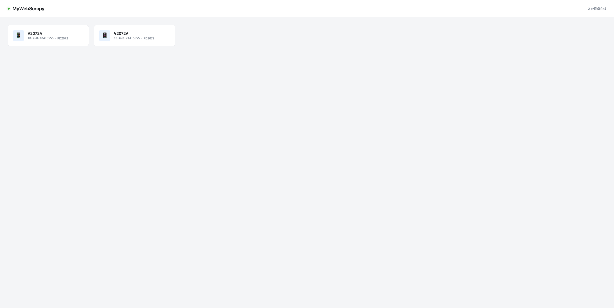
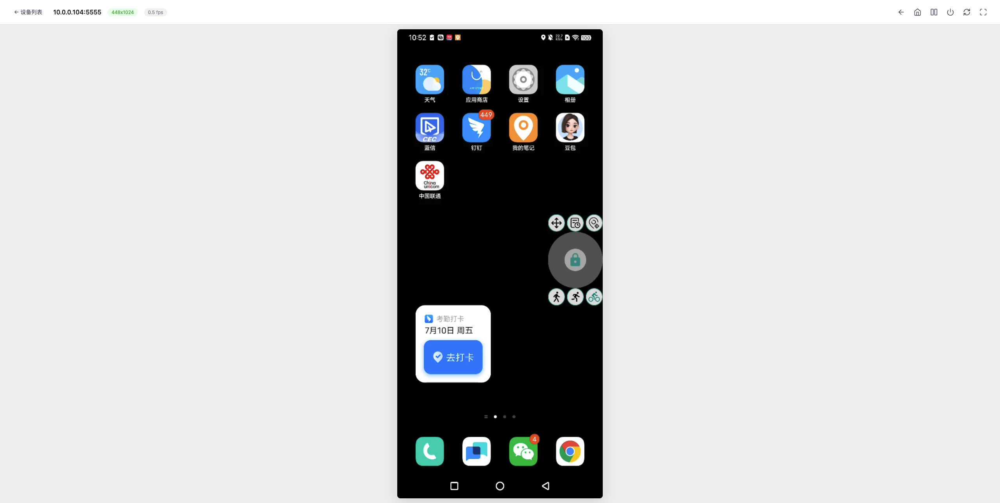

# MyWebScrcpy

基于 Go + WebCodecs 的浏览器端 Android 投屏工具。无需安装客户端，打开浏览器即可投屏和操控 Android 设备。

[English Version](README_EN.md)

## 截图

**设备列表**



**投屏操控**



## 特性

- 纯浏览器端，无需安装任何客户端
- 基于 WebCodecs 硬件解码，低延迟
- 支持 H.264 / H.265 / AV1 编码
- 鼠标操控：点击、拖拽、滚轮、右键返回
- 键盘输入：文本注入、快捷键
- 触摸支持（移动端浏览器）
- 一键旋转屏幕
- 全屏模式（支持 iOS 伪全屏）
- 屏幕熄灭检测
- 自动重连
- 单二进制文件，内嵌 scrcpy-server 和前端资源

## 原理

```
浏览器 ──WebSocket──▶ Go Server ──ADB Forward──▶ scrcpy-server (设备端)
  │                       │
  │  H.264 视频帧         │  控制消息透传
  │  ◀──────────────────  │  ──────────────▶
  │                       │
WebCodecs 解码          app_process 启动
Canvas 渲染             视频编码 + 控制注入
```

Go 后端负责：
1. 将内嵌的 scrcpy-server jar 通过 ADB push 到设备
2. 建立 ADB forward 隧道
3. 启动设备端 scrcpy server 进程
4. 通过 WebSocket 在浏览器和设备之间双向转发视频帧和控制消息

## 环境要求

- Go 1.21+
- ADB（Android Debug Bridge）
- Chrome 94+（需要 WebCodecs 支持）
- Android 设备已开启 USB 调试或已通过网络 ADB 连接

## 快速开始

```bash
# 克隆项目
git clone https://github.com/liuzhuogood/MyWebScrcpy.git
cd MyWebScrcpy

# 构建
go build -o mywebscrcpy .

# 运行
./mywebscrcpy
```

浏览器打开 `http://localhost:8080`，点击设备即可投屏。

### 命令行参数

| 参数 | 说明 |
|------|------|
| `-https` | 启用 HTTPS（使用内置自签名证书） |

### 环境变量

| 变量 | 说明 | 默认值 |
|------|------|--------|
| `PORT` | HTTP 监听端口 | `8080` |
| `ANDROID_HOME` | ADB 路径查找 | 系统 PATH |
| `TLS_CERT` | 自定义 SSL 证书路径 | - |
| `TLS_KEY` | 自定义 SSL 私钥路径 | - |

### HTTPS 配置

WebCodecs API 需要安全上下文（HTTPS 或 localhost）才能工作。如果通过 IP 地址访问，需要启用 HTTPS。

**方式 1：使用内置证书（最简单）**

```bash
./mywebscrcpy -https
```

访问 `https://IP:8080`，浏览器会提示证书不受信任，点击"高级"→"继续访问"即可。

**方式 2：使用自定义证书**

```bash
# 设置环境变量
export TLS_CERT=/path/to/cert.pem
export TLS_KEY=/path/to/key.pem
./mywebscrcpy
```

**方式 3：Nginx 反向代理（推荐生产环境）**

```nginx
server {
    listen 443 ssl;
    server_name your-domain.com;

    ssl_certificate /path/to/cert.pem;
    ssl_certificate_key /path/to/key.pem;

    location / {
        proxy_pass http://127.0.0.1:8080;
        proxy_set_header Host $host;
        proxy_set_header X-Real-IP $remote_addr;
    }

    location /ws {
        proxy_pass http://127.0.0.1:8080;
        proxy_http_version 1.1;
        proxy_set_header Upgrade $http_upgrade;
        proxy_set_header Connection "upgrade";
        proxy_set_header Host $host;
        proxy_read_timeout 86400;
    }
}
```

## 操控方式

| 操作 | 说明 |
|------|------|
| 鼠标左键 | 点击/拖拽 |
| 鼠标右键 | 返回键 |
| 鼠标滚轮 | 滚动页面 |
| 键盘 | 文本输入 |
| 工具栏 | Home、返回、最近任务、电源、旋转、全屏 |

## 项目结构

```
MyWebScrcpy/
├── main.go                    # 入口，HTTP 服务
├── assets/
│   └── scrcpy-server          # scrcpy server jar（内嵌）
├── internal/
│   ├── device/manager.go      # ADB 设备管理
│   ├── scrcpy/
│   │   ├── server.go          # scrcpy server 生命周期
│   │   ├── connection.go      # TCP 连接 + 帧读取
│   │   ├── protocol.go        # scrcpy 4.0 协议常量
│   │   └── control.go         # 控制消息打包
│   └── ws/hub.go              # WebSocket 管理
└── web/
    ├── index.html             # 设备列表页
    ├── player.html            # 投屏播放器页
    ├── css/style.css
    └── js/
        ├── decoder.js         # WebCodecs H.264 解码器
        └── control.js         # 浏览器端控制消息打包
```

## 技术栈

- **后端**: Go + gorilla/websocket
- **前端**: 原生 JS + WebCodecs API + Canvas
- **投屏协议**: scrcpy 4.0
- **视频编码**: H.264 (Baseline)

## License

MIT
