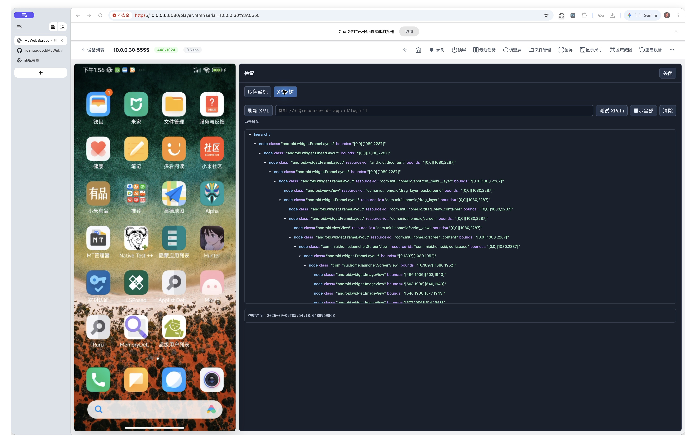

# MyWebScrcpy

一个基于 Go 和 WebCodecs 的开源 Android 设备投屏与控制工具。通过浏览器即可实时查看设备画面、执行触控和键盘操作，并管理设备的共享存储。访问端无需安装专用应用，Android 设备通过 ADB 连接到运行 MyWebScrcpy 的主机后即可使用。

[English](README_EN.md)

## 截图

**设备列表**


**投屏操控**


**播放器检查器**



**大屏监控**


**文件管理**


## 特性

- 纯浏览器端，无需安装任何客户端
- 基于 WebCodecs 硬件解码，低延迟
- 支持 H.264 / H.265 / AV1 编码
- 鼠标操控：点击、拖拽、滚轮、右键返回
- 键盘输入：文本注入、快捷键
- 触摸支持（移动端浏览器）
- 一键旋转屏幕
- 全屏模式（支持 iOS 伪全屏）
- 播放器检查器：取色坐标、像素放大镜、XML 树、XPath 与元素定位联动
- 设备音频播放：默认静音，用户可主动开启网页播放
- 受控 MP4 录屏：选择自动停止时长、可选录入设备声音、提前停止与完成下载
- 屏幕熄灭检测
- 自动重连
- 大屏监控模式（多设备同屏展示，支持小/中/大三档尺寸）
- 文件管理：浏览目录、搜索筛选、上传下载、移动、重命名、批量删除和撤销
- 单二进制文件，内嵌 scrcpy-server 和前端资源

## 原理

```
浏览器 ──WebSocket──▶ Go Server ──ADB Forward──▶ scrcpy-server (设备端)
  │                       │
  │  H.264 视频帧         │  控制消息透传
  │  ◀──────────────────  │  ──────────────▶
  │                       │
WebCodecs 解码          app_process 启动
Canvas 渲染             视频编码 + 控制注入
```

Go 后端负责：
1. 将内嵌的 scrcpy-server jar 通过 ADB push 到设备
2. 建立 ADB forward 隧道
3. 启动设备端 scrcpy server 进程
4. 通过 WebSocket 在浏览器和设备之间双向转发视频帧和控制消息

### Python Vision 对接

项目提供独立的 Vision WebSocket，Python 可以订阅同一套 scrcpy 视频会话，
返回识别框和自动化动作；浏览器会把识别结果叠加到投屏画面上。完整的二进制帧格式、
示例脚本、结果与动作协议见 [Python Vision 对接说明](docs/vision-integration.md)。

```bash
python3 -m pip install -r scripts/vision/requirements.txt
python3 scripts/vision/demo_vision.py --url ws://127.0.0.1:8080 --serial 10.0.0.30:5555
```

Vision 接口当前支持协议版本 `1`。显式发送未知版本会收到
`unsupported_protocol`；省略版本号仍兼容旧客户端。

## 环境要求

- Go 1.21+
- ADB（Android Debug Bridge）
- Chrome 94+（需要 WebCodecs 支持）
- Android 设备已开启 USB 调试或已通过网络 ADB 连接

## 快速开始

```bash
# 克隆项目
git clone https://github.com/liuzhuogood/MyWebScrcpy.git
cd MyWebScrcpy

# 构建
go build -o mywebscrcpy .

# 运行
./mywebscrcpy
```

浏览器打开 `http://localhost:8080`，点击设备即可投屏。

文件管理从投屏页面“更多”菜单打开，操作对象是当前选定手机的 `/storage/emulated/0` 共享存储。多手机场景下，每个投屏页面都会绑定自己的设备。

### 录屏

播放器工具栏提供“录制”入口。开始前选择 1 分钟至 8 小时的自动停止时长（默认 30 分钟）；可以提前停止，完成后直接下载 MP4。录屏复用当前设备的共享 H.264 会话，不中断投屏、控制或 Vision 订阅；每台设备同一时刻只能有一条录制。

| 方法 | 路径 | 说明 |
|------|------|------|
| `POST` | `/api/recordings?serial=...` | 请求体 `{"max_duration_ms":300000,"record_audio":false}`，创建录制；`record_audio` 缺省或 `false` 保持无声录像。 |
| `GET` | `/api/recordings?serial=...` | 获取该设备的录制记录。 |
| `GET` | `/api/recordings/{recording_id}?serial=...` | 查询状态。 |
| `POST` | `/api/recordings/{recording_id}/stop?serial=...` | 提前停止，幂等。 |
| `GET` | `/api/recordings/{recording_id}/download?serial=...` | 下载已完成的 MP4。 |
| `GET` | `/api/recordings/download?serial=...&recording_id=...` | 下载指定记录；省略 `recording_id` 下载最后一次完成的录像。 |
| `DELETE` | `/api/recordings/{recording_id}?serial=...` | 删除已结束的录制记录及文件。 |

录制仅支持当前默认的 H.264 共享流；未完成文件不会开放下载。完成文件会在受控目录中保留到期，服务重启会清理未完成的临时文件。

### 播放器检查器

在投屏页面打开“更多”中的“检查”。检查器会和投屏并排显示：投屏保持靠左的原始显示宽度，检查面板自动占用剩余空间；拖动中间分隔线可调整面板宽度。窄屏设备会自动改为上下布局。

#### 取色坐标

- 鼠标移动时显示画布坐标、HEX、RGB、十字线和 13 × 13 像素放大镜。
- 首次点击投屏画面会固定十字线与读数，便于复制；再次点击会解除固定并恢复跟随。
- 检查器打开期间的取色操作不会发送到 Android 设备。

#### XML 树与 XPath

- 切换到“XML 树”会读取当前设备的只读 UI 快照；也可以用“刷新 XML”重新获取。
- 树默认展开，标签、属性名、属性值和布尔值以轻量语法高亮显示；树区域有独立滚动条。
- 点击树节点会在投屏上标出对应元素；点击标出的绿框也会反选树节点。XML 原始坐标会按视频 Canvas 尺寸换算，因此缩放投屏时绿框仍与元素对齐。
- 选中树节点后，每个属性左侧都有复选框；勾选后会将对应属性组合为 XPath 条件、同步到输入框并自动测试，匹配元素随即显示绿框。默认优先选择非空 `resource-id`，没有时选择非空 `text`；其他属性（包括 `class`、`package`、`bounds`）可按需要加入，且默认不选。
- 输入 XPath 后点击“测试 XPath”，全部命中元素会显示绿框；“显示全部”可显示当前快照中所有带 bounds 的元素，再次点击可关闭。
- “清除”会清空 XPath 命中和所有元素标记。

XML 快照来自 Android 的 UI Automator，属于获取瞬间的静态状态，并不与视频逐帧同步。Canvas/WebView 等自绘内容可能没有可用节点；“显示全部”在元素密集的页面会产生较多重叠绿框。

| 方法 | 路径 | 说明 |
|------|------|------|
| `GET` | `/api/ui/xml?serial=...` | 获取指定在线设备的只读 XML 快照、时间戳和显示坐标基准 `display_size`。 |

### 受控 ADB 命令与组合键

`POST /api/adb/commands?serial=...` 仅以参数数组运行 `adb -s <serial> <args...>`，不执行宿主机 shell，也拒绝 `-s`、`--serial`、`-H`、`-P`、`-L` 等改变目标或 host 的参数。默认超时 60 秒；可用 `async: true` 查询后续状态，或以 `parallel: true` 在资源上限内显式绕过同设备 FIFO（调用方需自行承担设备状态竞态）。

`POST /api/sendkey?serial=...` 接收 `{"keycode":29,"modifiers":["ctrl","shift"]}`，支持 `shift`、`alt`、`ctrl`、`meta` 四种修饰键。

### Docker 部署

```bash
# 拉取镜像
docker pull liuzhuogood/mywebscrcpy:latest

# 运行（需要挂载 ADB 设备）
docker run -d \
  --name mywebscrcpy \
  --privileged \
  -p 8080:8080 \
  -v /dev/bus/usb:/dev/bus/usb \
  liuzhuogood/mywebscrcpy:latest

# 或者使用 host 网络（便于发现网络 ADB 设备）
docker run -d \
  --name mywebscrcpy \
  --privileged \
  --network host \
  -v /dev/bus/usb:/dev/bus/usb \
  liuzhuogood/mywebscrcpy:latest
```

浏览器打开 `https://IP:8080`（默认启用 HTTPS），点击设备即可投屏。

### 命令行参数

| 参数 | 说明 |
|------|------|
| `-https` | 启用 HTTPS（使用内置自签名证书） |

### 环境变量

| 变量 | 说明 | 默认值 |
|------|------|--------|
| `PORT` | HTTP 监听端口 | `8080` |
| `ANDROID_HOME` | ADB 路径查找 | 系统 PATH |
| `TLS_CERT` | 自定义 SSL 证书路径 | - |
| `TLS_KEY` | 自定义 SSL 私钥路径 | - |
| `FILES_MAX_UPLOAD_BYTES` | 单文件上传上限（字节） | `268435456` |
| `RECORDINGS_DIR` | MP4 录像目录 | 用户缓存目录下的 `mywebscrcpy/recordings` |
| `RECORDINGS_MAX_BYTES` | 录像目录总配额（字节） | `10737418240` |
| `RECORDINGS_RETENTION_HOURS` | 完成录像保留时长（小时） | `168` |
| `ADB_MAX_TIMEOUT_MS` | 单条 ADB 命令最大超时（毫秒） | `600000` |
| `ADB_MAX_QUEUE_WAIT_MS` | FIFO 命令最大排队时长（毫秒） | `600000` |
| `ADB_MAX_OUTPUT_BYTES` | 单条 ADB 命令最大输出（字节） | `1048576` |
| `ADB_MAX_PARALLEL_PER_SERIAL` | 同设备显式并行 ADB 命令上限 | `2` |

### HTTPS 配置

WebCodecs API 需要安全上下文（HTTPS 或 localhost）才能工作。如果通过 IP 地址访问，需要启用 HTTPS。

**方式 1：使用内置证书（最简单）**

```bash
./mywebscrcpy -https
```

访问 `https://IP:8080`，浏览器会提示证书不受信任，点击「高级」→「继续访问」即可。

**方式 2：使用自定义证书**

```bash
# 设置环境变量
export TLS_CERT=/path/to/cert.pem
export TLS_KEY=/path/to/key.pem
./mywebscrcpy
```

**方式 3：Nginx 反向代理（推荐生产环境）**

```nginx
server {
    listen 443 ssl;
    server_name your-domain.com;

    ssl_certificate /path/to/cert.pem;
    ssl_certificate_key /path/to/key.pem;

    location / {
        proxy_pass http://127.0.0.1:8080;
        proxy_set_header Host $host;
        proxy_set_header X-Real-IP $remote_addr;
    }

    location /ws {
        proxy_pass http://127.0.0.1:8080;
        proxy_http_version 1.1;
        proxy_set_header Upgrade $http_upgrade;
        proxy_set_header Connection "upgrade";
        proxy_set_header Host $host;
        proxy_read_timeout 86400;
    }
}
```

## 操控方式

| 操作 | 说明 |
|------|------|
| 鼠标左键 | 点击/拖拽 |
| 鼠标右键 | 返回键 |
| 鼠标滚轮 | 滚动页面 |
| 键盘 | 文本输入 |
| 工具栏 | Home、返回、最近任务、电源、旋转、全屏 |

## 项目结构

```
MyWebScrcpy/
├── main.go                    # 入口，HTTP 服务
├── assets/
│   └── scrcpy-server          # scrcpy server jar（内嵌）
├── internal/
│   ├── device/manager.go      # ADB 设备管理
│   ├── files/                  # 文件管理 API、路径安全和回收站
│   ├── uixml/                  # Android XML 快照服务与校验
│   ├── scrcpy/
│   │   ├── server.go          # scrcpy server 生命周期
│   │   ├── connection.go      # TCP 连接 + 帧读取
│   │   ├── protocol.go        # scrcpy 4.0 协议常量
│   │   └── control.go         # 控制消息打包
│   └── ws/hub.go              # WebSocket 管理
└── web/
    ├── index.html             # 设备列表页
    ├── player.html            # 投屏播放器页
    ├── dashboard.html         # 大屏监控页
    ├── files.html              # 文件管理页
    ├── css/
    │   ├── style.css            # 播放器与通用样式
    │   └── ui-inspector.css     # 检查器样式
    └── js/
        ├── decoder.js         # WebCodecs H.264 解码器
        ├── control.js         # 浏览器端控制消息打包
        ├── dashboard.js        # 大屏监控逻辑
        ├── files.js            # 文件管理逻辑
        └── ui-inspector.js     # 取色、XML 树和 XPath 检查器
```

## 技术栈

- **后端**: Go + gorilla/websocket
- **前端**: 原生 JavaScript + WebCodecs API + Canvas
- **投屏协议**: scrcpy 4.0
- **视频编码**: H.264 (Baseline)

## License

MIT
