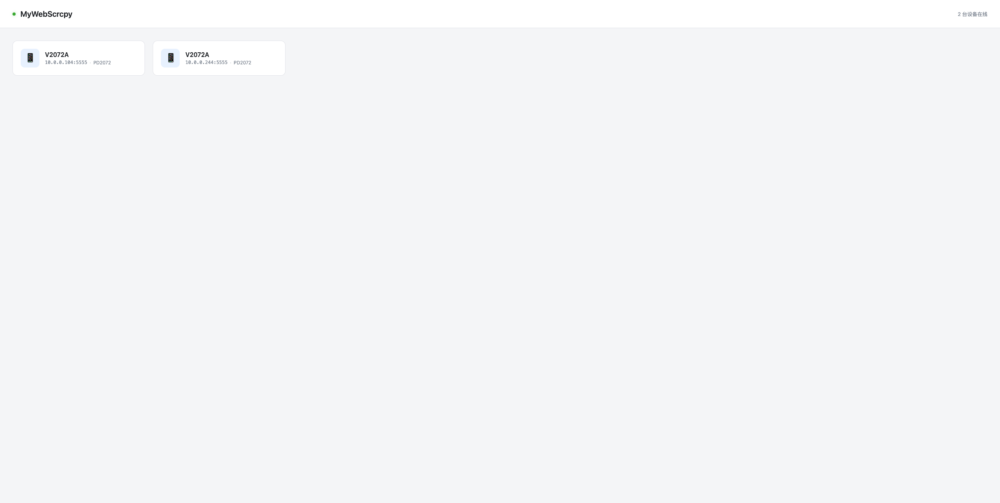
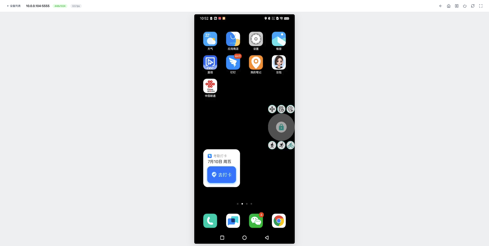
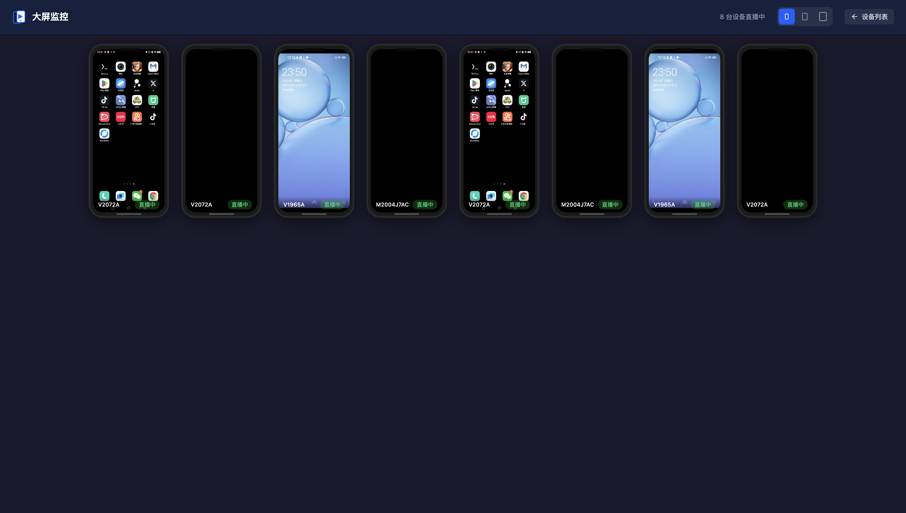
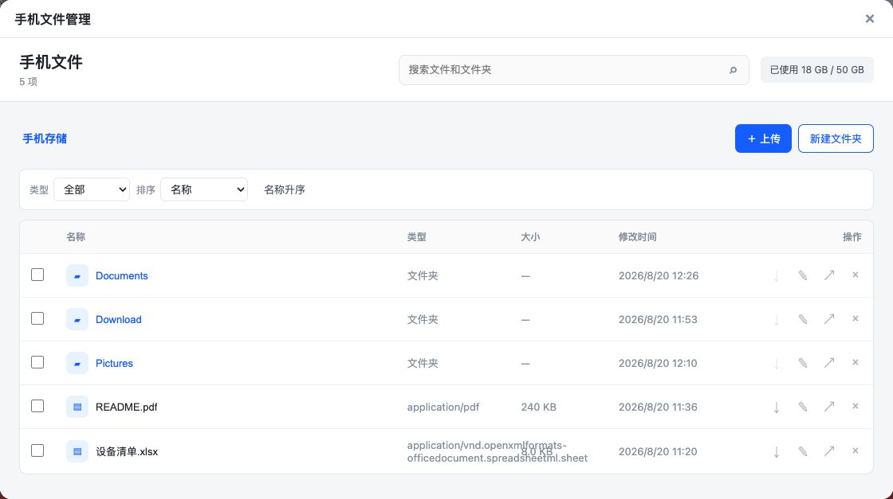

# MyWebScrcpy

An open-source Android device mirroring and control tool built with Go and WebCodecs. It provides live screen viewing, touch and keyboard input, and shared-storage management through a web browser. No dedicated app is required on the client side; connect the Android device to the host running MyWebScrcpy via ADB to get started.

[中文](README.md)

## Screenshots

**Device List**



**Screen Mirroring & Control**



**Multi-device Monitoring**



**File Manager**



## Features

- Browser-based, no dedicated client app required
- WebCodecs hardware decoding for low latency
- H.264 / H.265 / AV1 codec support
- Mouse control: tap, drag, scroll, right-click for back
- Keyboard input: text injection, shortcut keys
- Touch support (mobile browsers)
- One-click screen rotation
- Fullscreen mode (iOS pseudo-fullscreen supported)
- Screen-off detection
- Auto-reconnect
- Multi-device monitoring with small, medium and large device sizes
- File management: browse, search and filter, upload, download, move, rename, bulk delete and undo
- Single binary with embedded scrcpy-server and web assets

## How It Works

```
Browser ──WebSocket──▶ Go Server ──ADB Forward──▶ scrcpy-server (device)
  │                       │
  │  H.264 video frames   │  Control messages passthrough
  │  ◀──────────────────  │  ──────────────────────▶
  │                       │
WebCodecs decode        app_process launch
Canvas render           video encode + control inject
```

The Go backend handles:
1. Push embedded scrcpy-server jar to device via ADB
2. Establish ADB forward tunnel
3. Start scrcpy server process on device
4. Bidirectional forwarding of video frames and control messages between browser and device via WebSocket

## Requirements

- Go 1.21+
- ADB (Android Debug Bridge)
- Chrome 94+ (WebCodecs support required)
- Android device with USB debugging enabled or connected via network ADB

## Quick Start

```bash
# Clone
git clone https://github.com/liuzhuogood/MyWebScrcpy.git
cd MyWebScrcpy

# Build
go build -o mywebscrcpy .

# Run
./mywebscrcpy
```

Open `http://localhost:8080` in your browser, click a device to start mirroring.

Open the file manager from the player's “More” menu. It operates on the selected phone's shared `/storage/emulated/0` storage, so each player page remains bound to its own device in multi-device use.

### Docker Deployment

```bash
# Pull the image
docker pull liuzhuogood/mywebscrcpy:latest

# Run with ADB devices mounted
docker run -d \
  --name mywebscrcpy \
  --privileged \
  -p 8080:8080 \
  -v /dev/bus/usb:/dev/bus/usb \
  liuzhuogood/mywebscrcpy:latest

# Or use host networking for network ADB discovery
docker run -d \
  --name mywebscrcpy \
  --privileged \
  --network host \
  -v /dev/bus/usb:/dev/bus/usb \
  liuzhuogood/mywebscrcpy:latest
```

Open `https://IP:8080` in your browser (HTTPS is enabled by default), then click a device to start mirroring.

### Command-line Options

| Option | Description |
|--------|-------------|
| `-https` | Enable HTTPS with the built-in self-signed certificate |

### Environment Variables

| Variable | Description | Default |
|----------|-------------|---------|
| `PORT` | HTTP listen port | `8080` |
| `ANDROID_HOME` | ADB path lookup | System PATH |
| `TLS_CERT` | Custom SSL certificate path | - |
| `TLS_KEY` | Custom SSL private key path | - |
| `FILES_MAX_UPLOAD_BYTES` | Maximum size per uploaded file (bytes) | `268435456` |

### HTTPS Configuration

WebCodecs requires a secure context (HTTPS or localhost). When accessing the service through an IP address, enable HTTPS.

**Option 1: Use the built-in certificate**

```bash
./mywebscrcpy -https
```

Open `https://IP:8080`. The browser will warn that the certificate is untrusted; choose **Advanced** → **Continue** to proceed.

**Option 2: Use a custom certificate**

```bash
export TLS_CERT=/path/to/cert.pem
export TLS_KEY=/path/to/key.pem
./mywebscrcpy
```

**Option 3: Use Nginx as a reverse proxy (recommended for production)**

```nginx
server {
    listen 443 ssl;
    server_name your-domain.com;

    ssl_certificate /path/to/cert.pem;
    ssl_certificate_key /path/to/key.pem;

    location / {
        proxy_pass http://127.0.0.1:8080;
        proxy_set_header Host $host;
        proxy_set_header X-Real-IP $remote_addr;
    }

    location /ws {
        proxy_pass http://127.0.0.1:8080;
        proxy_http_version 1.1;
        proxy_set_header Upgrade $http_upgrade;
        proxy_set_header Connection "upgrade";
        proxy_set_header Host $host;
        proxy_read_timeout 86400;
    }
}
```

## Controls

| Action | Description |
|--------|-------------|
| Left click | Tap / drag |
| Right click | Back button |
| Scroll wheel | Scroll page |
| Keyboard | Text input |
| Toolbar | Home, Back, Recents, Power, Rotate, Fullscreen |

## Project Structure

```
MyWebScrcpy/
├── main.go                    # Entry point, HTTP server
├── assets/
│   └── scrcpy-server          # scrcpy server jar (embedded)
├── internal/
│   ├── device/manager.go      # ADB device management
│   ├── files/                  # File APIs, path safety and trash
│   ├── scrcpy/
│   │   ├── server.go          # scrcpy server lifecycle
│   │   ├── connection.go      # TCP connection + frame reading
│   │   ├── protocol.go        # scrcpy 4.0 protocol constants
│   │   └── control.go         # Control message packing
│   └── ws/hub.go              # WebSocket management
└── web/
    ├── index.html             # Device list page
    ├── player.html            # Screen mirroring player
    ├── dashboard.html         # Multi-device monitoring page
    ├── files.html              # File manager
    ├── css/style.css
    └── js/
        ├── decoder.js         # WebCodecs H.264 decoder
        ├── control.js          # Browser-side control message packing
        ├── dashboard.js        # Multi-device monitoring logic
        └── files.js            # File manager logic
```

## Tech Stack

- **Backend**: Go + gorilla/websocket
- **Frontend**: Vanilla JS + WebCodecs API + Canvas
- **Mirroring protocol**: scrcpy 4.0
- **Video codec**: H.264 (Baseline)

## License

MIT
