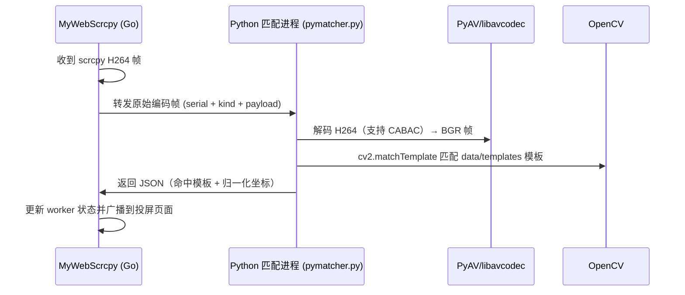

# MyWebScrcpy 模板匹配 · Python 引擎说明

本文说明 MyWebScrcpy 内置模板匹配所依赖的 Python 运行环境、部署方式与故障排查。

> 项目主页：<https://github.com/liuzhuogood/MyWebScrcpy>

---

## 1. 为什么需要 Python 环境

MyWebScrcpy 的实时模板匹配由**一个内嵌的 Python 匹配进程**完成：

| 能力 | 负责方 |
| --- | --- |
| H.264 视频解码（含 **CABAC**） | Python **PyAV**（基于 FFmpeg/libavcodec） |
| 模板匹配 | Python **OpenCV** (`cv2.matchTemplate`) |
| 模板加载 / 热更新 | Python 直接读取 `data/templates` 磁盘目录 |

**背景**：早期版本用纯 Go 的 `go264` 解码器。但部分设备的 scrcpy 视频流使用 **CABAC 熵编码**，而 `go264` 不支持 CABAC，导致这些设备（例如编码器默认走 CABAC 的机型）实时匹配完全失效。改用 PyAV（libavcodec）后即可正常解码与匹配。

> 匹配算法本身兼容 OpenCV 语义（`TM_CCOEFF_NORMED` / `TM_SQDIFF_NORMED`），参考实现可见仓库内
> `opencv_match`（Python 版模板匹配）与 OpenCV 官方模板匹配文档：
> <https://docs.opencv.org/4.x/d4/dc6/tutorial_py_template_matching.html>

---

## 2. 架构与时序

Go 服务启动时用 `subprocess` 拉起一个常驻 Python 进程，通过 stdin/stdout 双向通信：



- **模板数据**：Python 直接读 `data/templates`（含 `global/` 与各设备目录），与 Go 存储天然一致，上传新模板即热更新。
- **回退策略**：Python 环境不可用时，实时模板匹配**明确不可用**（会在启动日志与状态接口给出提示），不会静默降级为纯 Go 解码。

---

## 3. 环境要求

### 3.1 软件依赖

| 依赖 | 用途 | 安装 |
| --- | --- | --- |
| Python 3 | 匹配进程解释器 | 系统安装 |
| `av`（PyAV） | H.264 解码（含 CABAC） | `pip install av` |
| `opencv-python` | 模板匹配 | `pip install opencv-python` |
| `numpy` | 图像数组 | `pip install numpy` |

### 3.2 裸机（Linux / macOS）部署

```bash
# 1. 创建虚拟环境并安装依赖（推荐 venv）
python3 -m venv /opt/mywebscrcpy/pymatcher_venv
/opt/mywebscrcpy/pymatcher_venv/bin/pip install av numpy opencv-python

# 2. 指定匹配进程使用的 Python 解释器
export MYWEBSCRCPY_PYTHON=/opt/mywebscrcpy/pymatcher_venv/bin/python

# 3. 启动
/opt/mywebscrcpy/mywebscrcpy-linux-amd64 -https
```

> 若用 systemd 管理，可在 service unit 的 `[Service]` 段加入：
> `Environment=MYWEBSCRCPY_PYTHON=/opt/mywebscrcpy/pymatcher_venv/bin/python`

### 3.3 Docker 部署（推荐）

Docker 镜像**已内置完整 Python 匹配环境**，无需额外配置：

```bash
docker pull liuzhuogood/mywebscrcpy:latest
docker run -d \
  --name mywebscrcpy \
  -p 8080:8080 \
  liuzhuogood/mywebscrcpy:latest
```

镜像内已：
- 安装 `python3`、`pip`、`venv`
- 创建 `/app/pymatcher_venv` 并安装 `av`、`numpy`、`opencv-python`
- 设置环境变量 `MYWEBSCRCPY_PYTHON=/app/pymatcher_venv/bin/python`

Dockerfile 见仓库根目录（`RUN python3 -m venv /app/pymatcher_venv ...`）。

### 3.4 Windows 部署

- 需要安装 Python 3，并用 `pip install av numpy opencv-python` 安装依赖。
- 通过环境变量指定解释器（Windows 下命令通常是 `python` 而非 `python3`）：
  ```powershell
  $env:MYWEBSCRCPY_PYTHON = "C:\path\to\pymatcher_venv\Scripts\python.exe"
  ```
- 未配置时，启动日志会**明确提示**需要 Python 环境，实时模板匹配将不可用（服务本身照常运行）。

---

## 4. 配置项

| 环境变量 | 说明 | 默认 |
| --- | --- | --- |
| `MYWEBSCRCPY_PYTHON` | Python 匹配进程使用的解释器路径 | `python3` |

---

## 5. 状态与故障排查

### 5.1 查看匹配引擎状态

调用模板匹配状态接口：

```bash
curl -sk "https://<host>:8080/api/templates/status?serial=<serial>"
```

响应新增字段：

```json
{
  "python_ready": true,
  "python_error": ""
}
```

- `python_ready: false` 表示 Python 匹配进程未就绪。
- `python_error` 会给出具体原因（如找不到 Python、缺少 `av`/`cv2` 模块）。

### 5.2 启动日志

- 成功启动会打印：`[pymatcher] python 匹配进程已启动: <脚本路径>`
- Python 环境缺失时会打印醒目的错误提示，说明需要安装 `python3 + PyAV(av) + OpenCV` 或设置 `MYWEBSCRCPY_PYTHON`。

### 5.3 常见问题

| 现象 | 原因 | 解决 |
| --- | --- | --- |
| 日志提示 Python 环境缺失 | 未安装 Python 或 `av`/`cv2` | 按上文安装依赖并设置 `MYWEBSCRCPY_PYTHON` |
| `python_ready=false` | 启动时 Python 启动失败 | 查看 `python_error` 字段与日志 |
| 页面始终无匹配框 | 当前画面不包含模板元素 | 切换到包含模板元素的界面再观察 |
| 其他设备匹配、某台设备不匹配 | 该设备 scrcpy 使用 CABAC | 确认已启用 Python 引擎（此方案已解决 CABAC） |

---

## 6. 相关链接

- 项目主页：<https://github.com/liuzhuogood/MyWebScrcpy>
- Python 版模板匹配参考：仓库内 `opencv_match` 目录
- PyAV（Python 绑定 FFmpeg）：<https://pyav.org/>
- OpenCV 模板匹配：<https://docs.opencv.org/4.x/d4/dc6/tutorial_py_template_matching.html>
