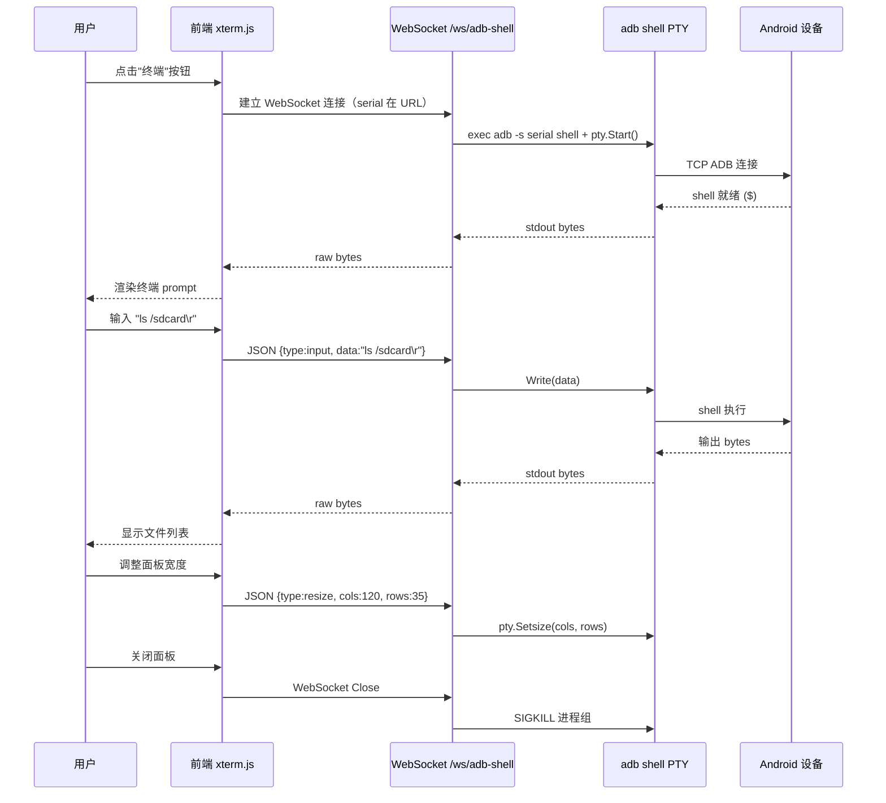
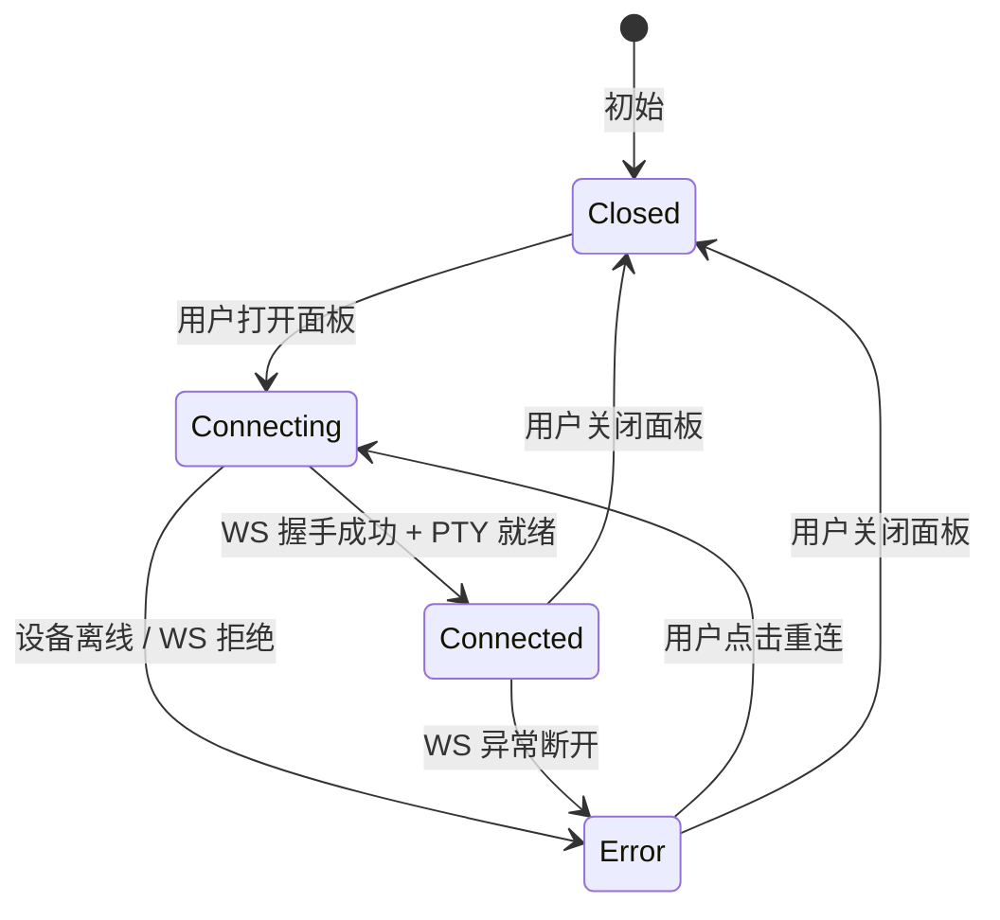

# v1.10.0-feature 设计文档

## 背景

MyWebScrcpy 已提供设备投屏、控制、录制、区域截图、UI 检查等功能，但缺少直接与设备交互的命令行入口。用户调试时往往需要离开页面切到本机终端执行 `adb shell`，打断操作流。本版本在播放器右侧新增一个可收起的 ADB Shell 侧边面板，使用 **xterm.js** 在浏览器中渲染完整终端，后端通过 WebSocket 桥接 PTY，实现与本机 `adb shell` 体验一致的交互终端。

## 目标与非目标

**目标：**

- 在播放器页新增可拖拽宽度的右侧侧边面板，内嵌 xterm.js 终端。
- 后端新建 `/ws/adb-shell?serial=xxx` WebSocket 端点，桥接 `adb -s <serial> shell` PTY。
- 支持完整终端功能：Ctrl+C、Tab 补全、方向键历史、颜色输出、窗口 resize 适配。
- 面板关闭时优雅终止 PTY 进程，不产生僵尸进程。

**非目标：**

- 不支持多 shell session 并发（每次打开面板只有一个 session）。
- 不持久化历史记录（关闭面板清空）。
- 不支持文件上传/下载（由现有文件管理功能覆盖）。
- 不允许通过面板修改 adb host/port 目标。

## 关键决策

### 1. 终端组件：xterm.js

- **理由**：MIT License，16k+ Star，是 VS Code、Azure Cloud Shell 的同款终端，社区活跃，API 稳定。
- **引入方式**：从 CDN 引入 `xterm@5.x` 及 `@xterm/addon-fit`（适配容器尺寸），不打包进二进制，无额外构建步骤；与现有项目 plain HTML + inline `<script>` 的风格一致。
- **CDN 地址**：`https://cdn.jsdelivr.net/npm/@xterm/xterm@5/css/xterm.css` 和对应 JS；`@xterm/addon-fit@0.10`。

### 2. 后端 PTY 桥接：`creack/pty` + `os/exec`

- 使用开源库 [`github.com/creack/pty`](https://github.com/creack/pty)（MIT），在服务端为 `adb -s <serial> shell` 分配伪终端（PTY），实现 Ctrl+C、Tab 补全等 POSIX 控制字符转发。
- WebSocket 帧格式：
  - **输入帧**（浏览器 → 服务端）：JSON `{"type":"input","data":"ls\r"}` 或 resize 帧 `{"type":"resize","cols":120,"rows":35}`。
  - **输出帧**（服务端 → 浏览器）：raw bytes（xterm.js `term.write(data)` 直接消费）。
- 替代方案评估：使用纯 `os/exec` 不分配 PTY 会丢失 Tab 补全和彩色输出；使用 SSH 协议（`golang.org/x/crypto/ssh`）更重且要求设备开 SSH，不适用。

### 3. 布局：复用 inspector 侧边面板模式

- 与 `ui-inspector` 共用 `.player-main` grid 布局，shell panel 占 grid 第三列，inspector 占第四列（二者可同时展开，互不干扰）。
- 若仅需一个侧边面板，可先仅实现 shell panel，inspector 样式不变。
- Resizer 拖拽逻辑复用现有 `setupResizer()` 模式。

### 4. 安全约束

- 服务端固定命令为 `adb -s <serial> shell`，serial 来自 URL query param，经 `devicegate` 校验设备在线。
- 禁止客户端通过 WebSocket 修改 adb host/port/serial（serial 在握手时绑定，连接期间不变）。
- 单设备同时只允许一个 shell session（超出时关闭旧 session）。
- PTY 超时（无活动 30 分钟）自动关闭。
- WebSocket 关闭时立即 kill PTY 进程组（SIGKILL，确保不残留子进程）。

## 业务流程

```mermaid
flowchart TD
  A[用户点击"终端"按钮] --> B{Shell Panel 当前状态}
  B -->|已关闭| C[打开 Shell Panel]
  B -->|已开启| D[关闭 Shell Panel]
  C --> E[前端建立 WebSocket /ws/adb-shell?serial=xxx]
  E --> F{设备在线?}
  F -->|否| G[WebSocket 返回错误并关闭]
  F -->|是| H[后端启动 adb shell PTY]
  H --> I[双向数据桥接]
  I --> J[用户输入命令]
  J --> I
  D --> K[前端关闭 WebSocket]
  K --> L[后端 kill PTY 进程组]
```

## 交互时序



## 状态机



## 拟修改文件清单

### 后端

#### [NEW] `internal/adbshell/handler.go`

WebSocket handler：验证 serial → `devicegate` 占位 → 启动 PTY → 双向 I/O 桥接 → 关闭时 cleanup。

#### [MODIFY] `go.mod` / `go.sum`

新增依赖 `github.com/creack/pty v1.1.x`（MIT）。

#### [MODIFY] `main.go`

注册路由 `mux.HandleFunc("GET /ws/adb-shell", adbShellHandler)`。

### 前端

#### [NEW] `web/js/adb-shell.js`

- 工具栏按钮点击事件。
- xterm.js `Terminal` + `FitAddon` 初始化。
- WebSocket 连接、输入转发（input/resize 帧）、输出渲染。
- 重连逻辑（指数退避，最多 3 次）。
- 面板 open/close 状态管理，联动 `.player-main` class。

#### [NEW] `web/css/adb-shell.css`

复用 `ui-inspector` 面板 CSS 变量和 grid 布局，添加 xterm.js 容器样式。

#### [MODIFY] `web/player.html`

- 在"更多"菜单添加"终端"按钮（`<button id="btn-adb-shell">`）。
- 在 `.player-main` 中添加 resizer + `<section class="adb-shell-panel">` 结构。
- 引入 xterm.js CDN CSS/JS 和 `adb-shell.js`。

## 风险与权衡

| 风险 | 影响 | 缓解 |
|------|------|------|
| CDN 不可用 | 面板无法加载 | 提示错误，投屏不受影响；后续可考虑本地化 |
| PTY 僵尸进程 | 资源泄漏 | 用进程组 kill，defer cleanup，超时自动关闭 |
| 同设备多 shell | 命令乱序 | 单设备仅允许一个 session，新连接关闭旧连接 |
| inspector + shell 同时开启布局拥挤 | 画布空间压缩 | 两个面板互斥（同时只能展开一个）或给用户可见提示 |
| Android 设备 adb shell 权限不足 | 命令失败 | 前端透传错误输出，不额外封装 |

## 待确认问题

1. **xterm.js 引入方式**：CDN（需联网，零构建）vs 本地化到 `web/` 目录（离线可用，需手动更新）？
2. **inspector 与 shell 面板并存策略**：互斥（同时只开一个）还是允许同时展开（左右并排）？
3. **PTY 超时时长**：无活动自动关闭，默认 30 分钟是否合适？
4. **`creack/pty` 仅支持 Unix**：Windows 服务端不支持 PTY，是否需要 Windows 兼容（降级为非 PTY exec）？
