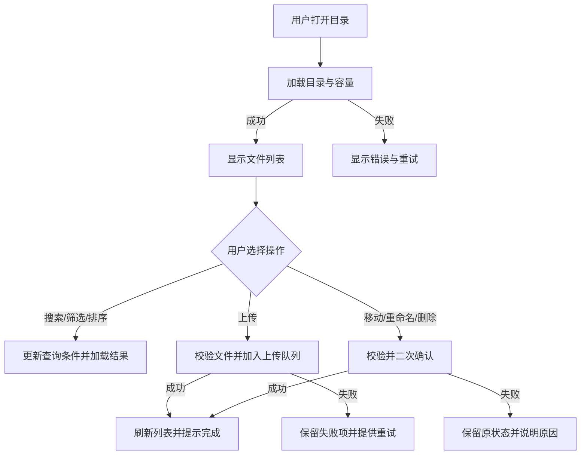

# v1.3.0-feature 设计文档

## 背景

本版本拟为手机文件管理场景设计一个清晰、可扩展的文件管理页面。用户需要在同一入口浏览自己的文件夹和文件，并完成搜索、上传、下载、移动、重命名、删除等常用操作，同时能理解当前位置、文件属性和存储空间使用情况。

本版本已从设计阶段进入实现阶段。文件 API、单用户边界、可选访问令牌和本地存储方式已按本文档落地；对象存储、多租户权限等扩展能力仍不在本版本范围内。

## 目标与非目标

**目标：**

1. 用面包屑和文件夹列表清晰表达当前目录层级，降低迷路和误操作风险。
2. 提供桌面端高效列表操作，并在窄屏移动端保持可浏览、可搜索、可操作。
3. 覆盖文件浏览、搜索、筛选、排序、上传、下载、移动、重命名、删除和批量操作的基本交互。
4. 为加载、空目录、上传进度、失败、无权限和删除确认提供可理解的状态反馈。
5. 使用普通用户能看懂的中文文案，危险操作二次确认，并尽可能支持撤销。

**非目标：**

1. 本版本不实现对象存储、断点续传、缩略图预览或多租户权限服务；文件根目录和可选访问令牌由现有单体服务负责。
2. 不定义图片/视频在线编辑、文档协同编辑、压缩解压和回收站的完整业务规则；可为后续版本预留入口。
3. 不改变现有设备列表、播放器和大屏的业务行为，不引入新的构建配置或生产部署依赖。
4. 不把设计术语直接作为面向用户的界面文案。

## 假设与确认范围

### 当前假设

- 页面默认面向已登录的单个用户；文件列表只展示该用户可访问的内容。
- 服务端使用 `FILES_DIR` 指定本地文件根目录，提供目录列表、文件元数据和文件操作接口；前端不自行拼接未经校验的路径。
- 文件元数据至少包含名称、类型、大小、修改时间、是否文件夹和可用操作。
- 存储空间可提供已用容量、总容量或可计算的容量数据。
- 页面运行在浏览器 Web 中，由现有 Go 服务以 HTTP 或 HTTPS 提供；默认支持现代桌面浏览器和移动端触摸浏览。
- 页面沿用项目当前无构建原生 Web 技术栈：语义化 HTML、共享 CSS 和原生 ES 模块/`fetch`；不新增前端框架、打包器或运行时依赖。

### 目标平台、技术栈与设计令牌（已确认）

根据当前仓库实现，冻结下一阶段页面的基础契约如下：

| 项目 | 冻结结论 |
| --- | --- |
| 运行平台 | 浏览器 Web；桌面端和移动端共用页面，移动端以触控操作为主 |
| 服务入口 | 由 `main.go` 的 `http.FileServer` 提供静态页面；可通过现有 HTTP/HTTPS 启动方式访问 |
| 页面入口 | 新增独立 `/files.html`，不改变设备列表 `/`、播放器 `/player.html` 和大屏 `/dashboard.html` |
| 前端资源 | 页面放在 `web/files.html`，逻辑放在 `web/js/files.js`，样式复用并扩展 `web/css/style.css` |
| 实现方式 | 原生 HTML/CSS/JavaScript + `fetch`；不引入 React、TypeScript、构建工具或第三方运行时 |
| 桌面布局 | 最大内容宽度建议 1440px，页面水平内边距 24px；列表为主，操作列保持至少 44px |
| 移动断点 | 以现有 `768px` 断点为第一适配边界；窄屏采用两行文件卡片、底部筛选/操作入口和 44×44px 触控目标 |

页面实现统一沿用当前 `web/css/style.css` 的视觉令牌：

| 语义 | 值 |
| --- | --- |
| 页面背景 | `#f5f6f8` |
| 内容面板 | `#fff` |
| 主文本 | `#1f2329` |
| 次要文本 | `#86909c` |
| 边框 | `#e5e6eb` |
| 品牌主色 | `#165dff` |
| 品牌悬停色 | `#0e4cd4` |
| 品牌浅色背景 | `#e8f3ff` |
| 成功色 | `#00b42a` |
| 危险色 | `#f53f3f` |
| 默认字体 | `-apple-system, BlinkMacSystemFont, "Segoe UI", Roboto, sans-serif` |
| 主要间距 | 4px 基准；区块间距 16–24px |
| 控件尺寸 | 桌面按钮高度约 36–40px；触控目标至少 44×44px |

页面契约冻结范围包括入口、资源边界、布局断点、视觉令牌和交互承载方式；后端接口、鉴权、路径规则、容量模型和冲突语义已按下节实现。

## 文件 API 契约

所有 `/api/files/*` 路由在设置 `FILES_TOKEN` 时要求 `Authorization: Bearer <token>`；未设置令牌时沿用现有单用户可信网络部署模式。服务端将相对路径规范化并拒绝绝对路径、`..`、反斜杠、空字节、`.trash` 和越出根目录的符号链接。

| 方法 | 路径 | 说明 | 主要请求字段 |
| --- | --- | --- | --- |
| `GET` | `/api/files` | 列出目录或按名称搜索 | `path`、`q`、`type`、`sort`、`order`、`page`、`page_size` |
| `GET` | `/api/files/download` | 下载文件 | 查询参数 `path` |
| `POST` | `/api/files/upload` | 上传单文件，使用临时文件后原子改名 | multipart `path`、`file`、`conflict` |
| `POST` | `/api/files/folders` | 新建文件夹 | JSON `path`、`name` |
| `POST` | `/api/files/move` | 移动文件或文件夹 | JSON `path`、`target`、`conflict` |
| `POST` | `/api/files/rename` | 原目录内重命名 | JSON `path`、`name`、`conflict` |
| `POST` | `/api/files/delete` | 移入服务端回收站并返回撤销令牌 | JSON `paths` |
| `POST` | `/api/files/undo` | 使用当前进程内令牌恢复删除项 | JSON `token` |

`conflict` 支持默认拒绝（`fail`）、保留副本（`rename`/`keep`）和显式覆盖（`replace`）。常见错误码为 `auth_required`、`invalid_request`、`forbidden`、`not_found`、`conflict` 和 `file_too_large`；响应统一使用 `{"error":{"code":"...","message":"..."}}`。

### 待确认问题

1. ~~目标平台是浏览器 Web、手机 WebView，还是需要同时适配现有桌面应用？~~ 已确认：浏览器 Web，兼容桌面端和移动端浏览器，不单独建设 WebView 或桌面应用。
2. ~~后端技术栈、文件 API、鉴权/租户边界、路径规则和错误码是什么？~~ 已确认并实现：Go 本地文件根目录、可选 `FILES_TOKEN`、相对路径校验和统一错误码见「文件 API 契约」。
3. ~~文件是否来自手机本地、服务器文件系统、对象存储，或多种来源？~~ 已确认：本版本使用服务端 `FILES_DIR` 文件系统，不接入对象存储。
4. ~~单文件和单次批量上传大小上限、允许的文件类型、同名文件覆盖策略是什么？~~ 已确认：单文件默认上限 256 MiB，可由 `FILES_MAX_UPLOAD_BYTES` 覆盖；文件类型不做前端白名单限制；冲突默认拒绝，也可显式保留副本或覆盖。
5. ~~删除是否进入回收站，撤销窗口多长；永久删除是否需要更高权限？~~ 已确认：删除移动到 `.trash`，当前进程内可撤销；本版本不提供永久删除界面。
6. 是否需要缩略图、预览、拖放上传、断点续传和离线能力？
7. ~~项目现有设计令牌、字体、图标库和前端框架是否必须沿用？~~ 已确认：沿用 `web/css/style.css` 的视觉基线和原生 HTML/CSS/JavaScript 技术栈，不新增框架与构建依赖。

## 信息架构与页面区域

页面从上到下、从全局到局部组织：

1. **顶部栏**：页面标题「我的文件」、全局搜索框、存储空间摘要、用户或返回入口。
2. **路径与操作栏**：面包屑（「我的文件 / 图片 / 2026」）、上传按钮、新建文件夹、视图切换；进入搜索状态时显示「退出搜索」。
3. **筛选与批量工具栏**：文件类型筛选、时间筛选、排序方式、选择数量和批量操作。未选中时保持轻量，选中后突出显示。
4. **主内容区**：文件夹和文件列表；默认按「文件夹在前、名称升序」排列。列表需要显示名称、类型、大小、修改时间和更多操作。
5. **辅助状态区**：加载、空目录、错误、无权限和上传队列。上传队列可固定在右下角或移动端底部抽屉，不遮挡主要内容。

## 桌面端布局与移动端适配

### 桌面端

- 页面采用居中内容容器，建议最大宽度 1440px，左右留白 24px。
- 顶部栏单行排列：标题在左，搜索框居中或占据可伸缩空间，容量摘要和账户操作在右。
- 内容区用列表为主；文件夹/文件名称列可伸缩，类型、大小、修改时间固定最小宽度，操作列保持 44px 点击区域。
- 桌面端支持拖放上传到列表或当前文件夹，拖入时显示覆盖层「松开以上传到此文件夹」。
- 批量选择后工具栏吸顶或紧贴列表顶部，避免用户滚动后找不到操作。

### 移动端

- 顶部栏拆为标题行和搜索行；容量摘要可折叠到「存储空间」入口。
- 列表改为两行卡片：第一行图标、名称和更多按钮，第二行类型、大小、修改时间；长名称省略并支持长按或详情查看。
- 面包屑改为「返回上级 + 当前目录」，层级较深时通过「...」折叠中间路径。
- 上传、新建文件夹和批量操作放入底部操作栏或「更多」菜单；危险操作不与主操作同色同层级。
- 筛选、排序使用底部抽屉；多选使用复选框和长按进入选择模式，保证触控目标至少 44×44px。

## 核心交互

### 文件夹导航

- 点击文件夹进入目录，双击仅作为桌面端可选增强，不作为唯一入口。
- 面包屑每一段可点击返回；当前目录名称不可重复触发加载。
- 刷新、返回和进入目录都应保留当前筛选和排序偏好（除非搜索上下文被退出）。

### 搜索、筛选与排序

- 搜索框支持按名称搜索，输入后按回车或停顿触发；显示「正在搜索『关键词』」。
- 搜索结果明确标注所在路径，点击结果可进入其目录或打开详情。
- 类型筛选建议提供「全部、文件夹、图片、视频、文档、音频、其他」；时间筛选提供「今天、近 7 天、近 30 天、自定义」。
- 排序提供「名称、修改时间、大小」，每项支持升序/降序；当前条件显示在按钮文本或标签中。
- 搜索、筛选无结果时文案为「没有找到匹配的文件」，同时提供「清除条件」。

### 上传、下载和文件操作

- 「上传」打开系统文件选择器；桌面端额外支持拖放。上传前检查容量和类型，开始后在上传队列显示进度、速度（如可得）和取消按钮。
- 单个下载直接触发下载；批量下载若服务端打包，需提示「正在准备下载」；不假定浏览器端自行压缩。
- 移动操作通过「选择目标文件夹」对话框完成，显示当前目标路径和「移动到这里」；跨目录失败不得清除原文件。
- 重命名使用行内编辑或对话框，回车保存、Esc 取消；校验空名称、非法字符和同名冲突。
- 删除支持单项和批量；确认框显示数量和名称摘要，提供取消和「移入回收站/删除」按钮。若支持撤销，成功后显示「已移入回收站，撤销」。

### 核心流程

下面只描述前端状态与服务端结果的边界，不规定具体 API 路径。

## 状态与错误处理

| 状态 | 展示方式 | 用户可执行动作 |
| --- | --- | --- |
| 首次加载 | 列表骨架屏或行级加载，不闪烁空状态 | 等待；超时后重试 |
| 空文件夹 | 文件夹图标 + 「这个文件夹还是空的」 | 「上传文件」「新建文件夹」 |
| 搜索无结果 | 「没有找到匹配的文件」 | 清除搜索/筛选 |
| 上传中 | 队列卡片、每项进度、整体进度 | 取消单项/全部；失败后重试 |
| 部分成功 | 「已完成 X 项，Y 项失败」 | 查看失败项、重试 |
| 网络或服务错误 | 「文件加载失败，请检查网络后重试」 | 重试，不丢失当前条件 |
| 无权限/登录过期 | 「暂时无法访问此文件夹」或「登录状态已过期」 | 返回上级/重新登录 |
| 同名冲突 | 明确冲突对象和选项 | 覆盖（若有权限）、保留两者、取消 |
| 删除确认 | 模态框显示数量和名称摘要 | 取消或确认；成功后撤销 |

## 中文界面文案

- 页面标题：`我的文件`
- 搜索占位：`搜索文件和文件夹`
- 主按钮：`上传`、`新建文件夹`
- 工具栏：`筛选`、`排序`、`选择全部`、`已选择 {count} 项`
- 菜单：`下载`、`移动到`、`重命名`、`删除`、`查看详情`
- 加载：`正在加载文件…`
- 上传：`正在上传 {name}`、`上传完成`、`上传失败，点击重试`
- 删除确认：`确定要删除这些文件吗？`、`删除后可在回收站中恢复。`
- 通用错误：`操作失败，请重试`；权限错误：`你没有访问此文件夹的权限`
- 容量：`已使用 {used} / {total}`；容量不足：`存储空间不足，请先删除或移动部分文件`

## 视觉建议

- 采用浅色中性背景（如 `#F7F8FA`）和白色内容面板，主色建议蓝色（如 `#2563EB`），用于主按钮、链接和选中态。
- 危险色仅用于删除确认和错误（如 `#DC2626`），成功使用绿色，警告使用琥珀色；颜色不能作为唯一状态表达，应配合文字或图标。
- 中文字体优先使用系统字体栈：`-apple-system, BlinkMacSystemFont, "Segoe UI", "PingFang SC", "Microsoft YaHei", sans-serif`。
- 页面基础字号建议 14px，标题 20–24px，行高 1.5；间距采用 4px 基准，主要区块间距 16–24px。
- 卡片圆角 8–12px，边框使用低对比度灰色，阴影轻量；按钮高度建议 36–40px，触控目标至少 44px。
- 文件类型图标使用统一线性图标并按类型提供辅助颜色；禁止使用仅靠颜色区分的图标状态。图标需有可读的 `aria-label` 或文本替代。

## 组件与实现建议

### 关键组件

1. `FileManagerPage`：页面状态、权限和整体布局。
2. `TopBar`、`StorageUsage`、`SearchBox`：全局标题、容量和搜索。
3. `Breadcrumbs`：目录层级和返回逻辑。
4. `FileToolbar`、`FilterSheet`、`SortMenu`：筛选、排序和批量操作。
5. `FileList`、`FileRow`、`FileGridItem`：桌面列表和移动端卡片视图。
6. `UploadQueue`、`UploadItem`：进度、取消和重试。
7. `MoveDialog`、`RenameDialog`、`DeleteConfirmDialog`：可复用的安全操作对话框。
8. `EmptyState`、`LoadingState`、`ErrorState`、`Toast/UndoToast`：状态反馈。

### 技术建议

- 若继续沿用项目当前无构建的原生 Web 风格，建议使用语义化 HTML、CSS Grid/Flex、原生 `fetch` 和模块化 JavaScript；组件可按 `web/` 现有目录拆分。
- 当前实现沿用原生 HTML/CSS/JavaScript，状态按「目录查询、选择集、上传队列、对话框」拆分；不新增前端依赖或构建配置。
- 文件 API 由后端统一返回结构化元数据和可操作权限；前端仅展示允许的操作，并通过 `AbortController` 处理过期目录请求。
- 若后续引入框架，应保持本版 API 和页面契约兼容，并单独记录构建配置迁移。

## 权限边界与安全要求

- 当前版本采用单用户文件根目录模型，不区分用户或租户；生产部署应设置 `FILES_TOKEN`，并通过 HTTPS 或受信任的反向代理保护令牌传输。
- 所有文件操作和下载都在服务端再次校验令牌、相对路径、根目录边界和符号链接目标；前端隐藏按钮不是权限控制。
- 文件名、路径和错误信息需避免渲染未转义 HTML；下载地址应使用短时授权或服务端代理，避免泄漏长期凭证。
- 删除、移动、重命名操作需要服务端校验当前版本/路径，失败时刷新受影响目录而不擅自修改本地状态。
- 不在版本文档、前端代码或日志中记录用户文件内容、访问令牌或存储密钥。

## 风险与权衡

1. **大目录性能**：一次加载全部文件会导致卡顿；优先确认分页/游标 API，前端采用虚拟列表或增量加载。
2. **大文件上传失败**：普通上传不可恢复；若业务需要稳定传输，应后续引入分片/断点续传，而不是在本版假装支持。
3. **批量操作部分失败**：逐项结果可能不一致；必须保留失败项并提供重试，不能只显示一个笼统成功。
4. **移动端空间有限**：列表字段会冲突；将次要字段降级为两行摘要或详情页，保持名称和操作可达。
5. **删除不可逆**：若后端无回收站，需在确认文案中明确不可恢复，并提高确认门槛。

## 迁移计划

1. 已确认目标平台、现有设计规范、文件 API、鉴权和容量模型，并完成原生页面实现。
2. 已通过本地接口、路径安全、令牌校验和桌面/移动浏览器冒烟验证。
3. 后续如需多用户、对象存储、断点续传或持久化回收站，应新增独立迁移设计，不直接改变当前本地根目录语义。

## 回滚计划

1. 文件管理入口是独立的 `/files.html` 和 `/api/files/*` 路由；出现问题时可移除入口链接并停止注册文件路由，不影响设备列表、播放器和大屏页面。
2. 文件数据位于 `FILES_DIR`；回滚代码不会自动删除该目录或其中的用户文件。
3. 删除操作先移入根目录 `.trash`，撤销令牌仅在当前进程有效；任何数据迁移必须单独审批并提供恢复方案。
