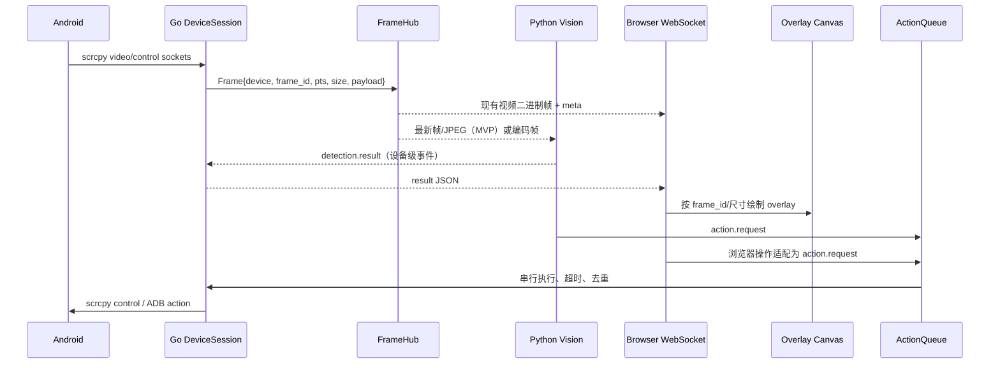

# v1.4.0-feature 设计文档

## 背景

MyWebScrcpy 已能通过 Go 启动设备端 scrcpy-server，经 ADB forward 读取 H.264/H.265/AV1 帧，并由浏览器 WebCodecs 解码到 Canvas；浏览器控制消息也能透传到 scrcpy control socket。当前媒体与控制生命周期绑定在单个 `/ws?serial=` 连接中，Python 无法安全订阅帧，检测结果也没有回传前端的通道。

## 目标

1. Go 继续独占设备发现、ADB、scrcpy-server、视频读取、浏览器投屏和 Android 控制。
2. 增加供 Python Vision 服务订阅的实时帧接口，先以最新帧/JPEG 的低复杂度 MVP 验证链路，再评估编码流优化。
3. 增加检测结果的设备级广播，使播放器和大屏可以用 Canvas/SVG overlay 反显框、标签、置信度和状态。
4. 将 Python 或前端发起的点击、滑动、按键等动作统一进入 Go Action API/队列，进行设备绑定、顺序控制、限流和审计。
5. 保持现有浏览器投屏协议、控制打包方式和单二进制部署可用；逐阶段支持多设备和诊断能力。

## 非目标

- 本版本不把 Python/OpenCV/YOLO/OCR 嵌入 Go，也不在 Go 中实现模型推理。
- 不第一步改成 H.264 在 Python 侧解码，不直接重写 scrcpy 协议或 WebCodecs 解码器。
- 不引入 Vue、React、TypeScript、打包器或常驻外部消息队列；当前前端继续使用原生 JavaScript。
- 不默认开放公网 Vision/Action 接口；鉴权、来源限制和部署边界必须先明确。
- 不把 Python 直连 ADB 作为默认业务控制路径；后期可在明确设备归属、权限和并发规则后，以受控旁路方式启用。

## 已核查的现状与复用点

| 领域 | 当前实现 | 计划复用/调整 |
| --- | --- | --- |
| 设备 | `internal/device/manager.go` 的 `Device`、`ListDevices`、2 秒轮询 | 增加设备在线校验/能力信息，不改变现有 `/api/devices` 语义 |
| scrcpy 启动 | `internal/scrcpy/server.go` 的 `ServerConfig`、push/forward/Start/Stop | 由设备级媒体会话持有，避免每个订阅者重复启动 |
| 视频 | `internal/scrcpy/connection.go` 的 `Frame`、`ReadFrame`、尺寸/PTS/codec | 抽取发布前的帧事件；保留现有 WS 二进制封包 |
| 控制 | `Connection.WriteControl`、`web/js/control.js` 打包格式 | 统一由 Action 层调用，浏览器协议先兼容透传 |
| WebSocket | `internal/ws/hub.go` 的 `session`、`pumpVideo`、`pumpControl` | 引入设备级 Session/FrameHub 与订阅者角色，保留旧入口适配器 |
| 渲染 | `web/js/decoder.js` 在 Canvas 绘制 VideoFrame | `player.html` 增加同尺寸 overlay Canvas；解码 Canvas 不改为视频重编码 |

## 目标架构



关键原则是原始视频与检测元数据分离：Python 不重新编码浏览器视频；overlay 只在浏览器合成。MVP 可以让 FrameHub 在 Go 侧把已读到的帧转换为 JPEG 给 Vision，浏览器继续收到原协议帧。

### Python 的回传方向（已明确）

是的，MVP 建议使用 WebSocket，但要区分职责：

```text
Go FrameHub ──(binary JPEG + frame 元数据)──▶ Python Vision
Go ResultHub ◀─(JSON detection.result)────── Python Vision
                         │
                         └─(JSON action.request，可选)
```

Python 不是把结果写回视频帧，也不是直接操作 `scrcpy.Connection`。更准确地说，Python 通过 WebSocket 回传给 Go 的 **VisionGateway/ResultHub**；ResultHub 再把结果按 `device_id/session_id` 广播给浏览器 overlay，并把动作请求交给 `ActionQueue`。FrameHub 负责帧的生产、缓存和分发，ResultHub 负责识别结果的接收与广播，两者可由同一个 Go `Session` 持有，但接口职责不要混成“FrameHub 处理所有业务”。

MVP 为减少连接管理复杂度，可以采用一条双向 WebSocket：

```text
WS /api/vision/stream?serial=<serial>
Go → Python：JSON hello/frame + binary JPEG
Python → Go：JSON detection.result / action.request / heartbeat
```

但协议上仍保留消息方向和类型。后续如果识别流量、权限或部署位置需要独立扩展，再拆成两个连接：只读帧订阅 WS 与只写结果上报 WS；浏览器结果广播继续使用 Go 的设备级事件通道。无论一条还是两条连接，服务端都必须以连接绑定的 `serial` 为准校验 `device_id`，不能信任 Python 任意指定设备。

## 分阶段计划

### 阶段一：MVP（单设备、最新帧、可观察闭环）

建议版本目标：先证明“Go 读帧 → Python 识图 → 结果回传 → 前端反显 → Go 执行动作”完整闭环。当前实现验证阶段采用 scrcpy 原始编码帧，不在 Go 侧做 JPEG 转码；JPEG/latest-frame 采样保留到低延迟优化阶段。

建议新增/修改：

- `internal/session/session.go`：设备级生命周期，封装 `scrcpy.Server`、`Connection`、启动/停止、订阅者计数和尺寸/codec 元数据。
- `internal/session/framehub.go`：每设备一个有界 latest-frame 缓存；分配单调 `frame_id`，记录 `timestamp`、PTS、宽高和关键帧标志；慢订阅者丢旧帧而不阻塞视频。
- `internal/vision/protocol.go`：定义帧订阅、检测结果和错误消息，先使用 JSON 控制消息 + binary JPEG 数据。
- `internal/action/queue.go`、`internal/action/types.go`：设备级有界串行队列，统一校验、超时、取消、来源和结果。
- `internal/ws/hub.go`：从“每 WS 启动 session”改为“按 serial 获取/复用 session”；旧浏览器收到的 meta 和 `[kind][pts][payload]` 保持不变。
- `main.go`：注册内部/受控 Vision 路由和 Action 路由，加入配置项但默认关闭外部访问。
- `web/player.html`、`web/css/style.css`：在 `.screen-wrap` 中增加 overlay Canvas，和视频 Canvas 同步尺寸/缩放；不拦截现有触控。
- `web/js/overlay.js`：按归一化坐标绘制框、标签、置信度、动作状态；按 `frame_id` 丢弃明显过期结果。
- `web/js/decoder.js`：仅补充最近显示帧 ID/尺寸回调所需钩子，避免改动解码路径。

接口草案（MVP）：

```text
GET /api/devices
WS  /ws?serial=<serial>                         # 兼容现有浏览器投屏
WS  /api/vision/stream?serial=<serial>          # MVP：双向帧订阅/结果回传
WS  /api/vision/events?serial=<serial>          # 可选后续拆分：结果/动作上报
POST /api/devices/<serial>/actions              # 受控 HTTP Action API
```

Vision 帧消息建议：

```json
{"type":"hello","device_id":"<serial>","format":"jpeg","max_fps":5}
{"type":"frame","frame_id":182731,"timestamp":1730000123456,"width":1080,"height":2400,"encoding":"jpeg"}
```

当前实现中，`hello` 的 `format` 为 `scrcpy-frame`；后续每个 binary 消息复用现有 `[kind][pts][payload]` 封包（session 帧携带宽高），并非 JPEG。Python 应按 `codec` 能力用 PyAV 等方式解码。Go 不等待 Python 返回结果再继续推送视频；JPEG 采样仍是后续可选能力。hello、frame、result 和 stats 均带 `session_id`，用于隔离重连后的旧结果。

Python 回传给 Go 的检测结果建议：

```json
{
  "type":"detection.result", "device_id":"<serial>",
  "frame_id":182731, "timestamp":1730000123456,
  "objects":[{"label":"确认按钮","confidence":0.96,"x":0.61,"y":0.72,"w":0.18,"h":0.07}]
}
```

Go 收到 `detection.result` 后不直接修改 `FrameHub` 的媒体缓存，而是交给 `ResultHub`：先校验 `device_id`、`session_id`、`frame_id`、坐标和大小，再广播给浏览器并记录延迟/丢弃原因。`action.request` 则只进入 `ActionQueue`，由队列决定是否执行。

动作建议：

```json
{"request_id":"r-1","device_id":"<serial>","source":"vision","action":"tap","x":0.70,"y":0.75,"frame_id":182731,"expires_ms":1000}
```

坐标统一使用 0–1 归一化值；服务端转换为当前 session 的设备像素并再次边界校验。动作响应包含 `request_id`、`accepted`、`executed`、`error_code`、`executed_at`。

### 阶段二：低延迟优化（仍保持协议兼容）

- 将 FrameHub 从“每帧 JPEG 编码”升级为可配置采样：`latest JPEG`、共享解码帧或 H.264 Annex-B/AVCC 旁路；Python 通过能力协商选择格式。
- 引入按消费者的 `max_fps`、最大尺寸、质量、关键帧优先和背压统计；Vision 默认 5–10 FPS，浏览器保持现有 15 FPS。
- 避免重复编码：评估从 scrcpy payload 直接复制到 Vision，明确 Python 解码库与 codec 能力后再启用。
- 将 `frame_id` 与检测结果/动作绑定，提供过期检测、延迟、丢帧和队列深度指标；结果广播支持按设备/会话过滤。
- ActionQueue 增加去重键、动作冷却、每设备互斥和断线取消，防止模型重复点击。

### 阶段三：多设备、权限与调试能力

- `SessionRegistry` 按 serial 管理多设备会话、订阅者和状态；设备离线时向所有订阅者发送明确事件并清理队列。
- 增加 Vision 客户端身份/令牌、来源限制、每设备授权和只读订阅模式；默认只监听本机或受信任内网。
- 提供调试页或播放器调试抽屉：显示 frame_id、FPS、端到端延迟、编码格式、Vision 最近心跳、动作队列和丢帧原因。
- 增加事件日志/环形缓冲，可按 `device_id`、`session_id`、`request_id` 关联排查；敏感数据和完整视频不写普通日志。
- 大屏复用同一 overlay/event 订阅模型；多设备页面不能共享错误的 serial 或检测结果。

## 兼容策略

1. `/ws?serial=` 和现有二进制帧头完全保留；前端无 Vision 时行为不变。
2. Session 复用先只在同一 Go 进程内启用；若发现旧客户端依赖独占生命周期，提供配置开关回退为旧模式。
3. Vision/Action 路由默认关闭或仅绑定本机；未协商的 codec、消息类型和坐标版本返回明确错误，不静默猜测。
4. 新 JSON 消息带 `protocol_version`，结果对象允许新增字段；未知字段忽略，未知动作拒绝。
5. 旧控制二进制仍可透传，但新自动化路径必须走 ActionQueue，以便后续收紧权限和审计。
6. Python 后期即使需要直接 ADB，也不与本架构冲突：它可以作为独立的诊断、设备信息读取、安装/准备环境或低频维护通道；涉及点击、滑动、按键、文本注入等可能与 scrcpy 控制通道并发的动作，默认仍经 Go ActionQueue。若确需直连 ADB 执行动作，必须显式声明 `control_mode=adb`，并对同一 `device_id` 获取互斥租约，暂停或排空 Go 队列后再执行。

## 风险与应对

| 风险 | 影响 | 应对 |
| --- | --- | --- |
| 每个浏览器连接当前都会独立启动 scrcpy | 重复占用设备和端口，复用改造易引入竞态 | 先加 SessionRegistry 单元测试，启动/停止引用计数后再切流 |
| JPEG 编码增加 CPU、内存和延迟 | Vision 读帧不稳定 | latest-only 有界缓存、限 FPS/尺寸/质量，记录编码耗时 |
| Python 检测结果对应旧帧 | 框漂移、误点击 | 强制 frame_id/timestamp，前端过期丢弃，Action 设置 expires_ms |
| 视频尺寸旋转/编码器重启 | 坐标和解码器失效 | 传播 session/meta 事件，清理旧检测，要求新尺寸后再执行动作 |
| Vision 或浏览器慢消费者 | 阻塞主视频流 | 每订阅者独立有界队列，丢旧帧并统计，不在读帧 goroutine 等待 |
| 自动动作误触/重复执行 | 设备状态被破坏 | 默认 dry-run/人工确认开关、动作白名单、冷却/去重/超时和审计 |
| 外部 WS/HTTP 暴露控制能力 | 未授权控制设备 | 本机绑定、显式配置、鉴权、Origin/来源校验和最小权限 |
| 多设备结果串线 | 错误设备执行动作 | 所有消息强制携带 device_id/session_id，服务端以连接绑定 serial 为准 |
| H.265/AV1 Python 能力不一致 | Vision 无法解码 | MVP 默认 H.264 scrcpy-frame；其他编码流仅在能力协商成功后开放 |
| Python 直连 ADB 与 Go 控制并发 | 点击顺序错乱、设备串线、状态难以审计 | 将 ADB 作为显式能力和独立来源；设备级互斥租约、动作来源标记、超时和审计；默认禁止并发控制 |

## 迁移与回滚

迁移顺序：先加接口与测试 → 以适配器复用现有 `pumpVideo/pumpControl` → 默认关闭 Vision/Action → 单设备灰度 → 开启 Session 复用 → 再启用低延迟格式和多设备能力。任何阶段均可关闭新路由并回退到现有 `/ws` 独立会话；不删除现有前端控制打包和 scrcpy 解析代码。若 Session 复用出现问题，保留旧 `startSession` 路径作为临时兼容实现。后期接入 Python ADB 时，先只开放只读/维护类命令；控制类 ADB 命令必须经过租约和开关，出现异常可立即关闭旁路而不影响视频订阅。

## 待确认问题

1. Python Vision 服务部署在同一主机、局域网还是容器；是否需要跨主机订阅？
2. MVP 是否接受 1–5 FPS JPEG，还是必须从第一版支持 H.264？
3. Vision/Action 是否需要鉴权、TLS、租户或只允许本机调用？
4. 自动动作默认是 dry-run、人工确认，还是允许特定动作自动执行？
5. 检测 overlay 只用于播放器，还是第一版同时覆盖大屏 dashboard？
6. 是否需要保存截图/检测历史；如需要，保留周期和脱敏规则是什么？
7. Python 直连 ADB 的首批用途是只读诊断/安装准备，还是包含控制动作？若包含控制动作，是否接受设备级互斥租约和“Go 队列暂停后执行”的规则？
