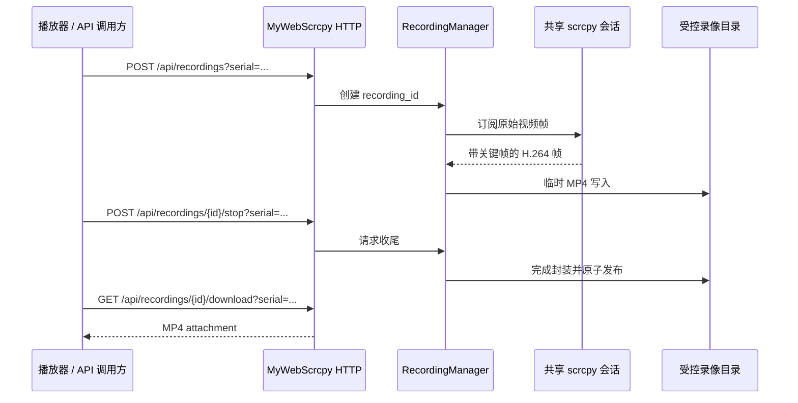

# v1.5.0-feature MyWebScrcpy 录屏与自适应播放器工具栏

## 背景

MyWebScrcpy 已维护每台设备的共享 scrcpy 会话、原始视频帧、会话生命周期和 Web 控制界面。OpenCV 服务虽然能订阅 Vision 流，但不应为录像再复制一条解码/编码与文件管理链路。播放器现有工具栏有“更多”菜单；用户要求主要操作保持直接可见，只在实际可用空间不足时收起低优先级按钮。

## 目标

1. 在 MyWebScrcpy 增加受控的 MP4 录屏启动、停止、状态查询和下载 API。
2. 录屏复用同 serial 的共享 scrcpy 会话，不能中断播放器、Vision 检测或设备控制。
3. 在播放器增加直接可见的录制/停止入口、明确录制中状态和完成后的下载入口。
4. 工具栏默认展示主要按钮；仅在容器实际溢出时，将低优先级按钮移入“更多”。
5. 控制录像的单设备并发、最大时长、磁盘配额、过期清理和下载边界。
6. 提供受控的任意 ADB 参数执行入口，覆盖 ADB shell 与其他设备命令，同时不开放宿主机 shell。
7. 支持 Ctrl、Alt、Shift、Meta 加一个主按键的 Sendkey 组合键。

## 非目标

1. 不经 OpenCV 或 ADB 实现录像；不重复转码已有录像，也不录制设备音频。
2. 不允许 API 指定任意输出目录、文件名或无限制时长。
3. 不在本期提供直播推流、剪辑、拼接、云存储上传或后台批量录像。
4. 不因桌面宽度或固定断点而默认隐藏所有工具按钮；也不修改用户当前未提交的播放器页面和样式改动。
5. 不提供 `sh -c`、`bash -c`、PowerShell、任意宿主机命令、调用方指定 adb 二进制路径或 ADB host/transport 参数。
6. 不支持任意多键按住、可编程按下/抬起时序或通过文本动作模拟组合键。

## 原始 ADB 命令接口

`POST /api/adb/commands?serial={serial}` 接收 JSON 参数数组：

```json
{"args":["shell","pm","list","packages"],"timeout_ms":10000}
```

服务端只允许以参数方式执行 `adb -s <serial> <args...>`，绝不把输入拼接进宿主机 shell。`args` 可以是任意 ADB 子命令及其参数，故可覆盖 `shell`、`install`、`pull`、`push`、`logcat` 等通用场景；但数组内不得包含 `adb`、`-s`、`--serial`、`-H`、`-P`、`-L` 等会改变客户端、目标设备或 host 的参数。`serial` 必须由查询参数显式给出，不能从 `args` 推断。

`timeout_ms` 可选，省略时默认 `60000` 毫秒。调用方可以传入更短或更长的时长；服务端按配置的 `ADB_MAX_TIMEOUT_MS` 施加最终上限，超过上限的请求返回 HTTP 400，不静默无限延长。响应返回 HTTP 200 与受限长度的 `stdout`、`stderr`、`exit_code`、`elapsed_ms`、`truncated`；进程达到有效超时时返回 HTTP 504 并杀死子进程，设备不可用为 HTTP 503。输出总长度必须截断到配置上限，且响应不记录/回显调用方鉴权信息。

默认使用 per-serial `CommandGate`：同一设备同一时间只实际运行一条原始 ADB 命令，但可以连续提交多条；后续命令进入 FIFO 队列，不返回“busy”或丢弃。不同 serial 使用不同 gate，可真实并行。`parallel: true` 显式绕过该 gate，允许同一 serial 的多条 ADB 命令并行，也允许与 scrcpy 控制同时运行；调用方负责命令与设备状态的竞态。并行模式仍执行每条命令的超时、输出截断和子进程回收，并受 `ADB_MAX_PARALLEL_PER_SERIAL` 配置的资源上限保护。长时间流式命令（例如 logcat）默认 60 秒，但可通过 `timeout_ms` 在服务端上限内延长；不提供无超时的后台无限运行模式。本接口仅允许本机或受控内网访问；若服务需跨网暴露，必须先完成认证与授权设计。

为避免第二条命令因排队而占用 HTTP 连接，`POST /api/adb/commands` 新增 `async` 布尔字段：默认 `false` 时保持同步，接口等待排队和执行完成后返回结果；`async: true` 时立即返回 HTTP 202、`command_id` 和 `queued` 状态。新增 `GET /api/adb/commands/{command_id}?serial=...` 查询 `queued`、`running`、`completed`、`failed`、`timed_out` 或 `cancelled` 状态及完成结果。命令执行超时从实际进入 `running` 后开始计算；排队超时由独立的 `ADB_MAX_QUEUE_WAIT_MS` 配置限制，过期命令不执行。`parallel: true` 的命令不进入 `queued`，启动后状态直接为 `running`。

并行示例：

```json
{"args":["shell","logcat","-d"],"timeout_ms":120000,"parallel":true,"async":true}
```

## 组合键协议

MyWebScrcpy 的 `action="key"` 增加可选 `meta_state`（无符号 32 位 Android meta state）。Vision WebSocket 的 `vision.Message`、ActionQueue 的 `action.Request` 和设备执行器必须完整透传它，并在 `scrcpy.KeyCodeEvent` 的 down/up 两次调用中使用同一个值。

上层 HTTP 调用使用受限修饰键数组，而不是暴露位掩码：

```json
{"keycode":29,"modifiers":["ctrl","shift"]}
```

允许 `shift`、`alt`、`ctrl`、`meta`，不得重复；服务端将其映射为 Android meta state。请求中的主 `keycode` 必填，`text` 与 `modifiers`/`keycode` 互斥。`keycodes` 顺序序列保持“逐键按下抬起”的既有语义，不能代表组合键。

## 架构与数据流



录屏订阅与播放器、Vision 订阅并存；录像任务不拥有也不关闭共享 session。必须从可解码关键帧开始记录，并在停止后成功完成 MP4 容器封装后才能开放下载。

## HTTP 接口

所有接口通过 `serial` 查询参数锁定设备，沿用 MyWebScrcpy 的当前设备接口习惯。

| 方法 | 路径 | 含义 |
| --- | --- | --- |
| `POST` | `/api/recordings?serial={serial}` | 启动 MP4 录屏。 |
| `GET` | `/api/recordings/{recording_id}?serial={serial}` | 查询录屏状态。 |
| `POST` | `/api/recordings/{recording_id}/stop?serial={serial}` | 请求停止，幂等。 |
| `GET` | `/api/recordings/{recording_id}/download?serial={serial}` | 下载完成的 MP4。 |

启动请求：

```json
{"max_duration_ms":300000}
```

`max_duration_ms` 是防忘记的必填自动停止时长，取值 `60000`～`28800000`（1 分钟～8 小时）；服务端必须在到期时自动进入 `stopping` 并完成 MP4 封装，不能产生无限时录像。实际编码/封装策略、全局配额和保留期由服务配置确定。启动成功返回 HTTP 202：

```json
{"recording_id":"rec_xxx","serial":"10.0.0.30:5555","status":"recording","started_at":"2026-09-09T12:00:00Z","max_duration_ms":300000}
```

状态为 `recording`、`stopping`、`completed`、`failed` 或 `expired`。每个 serial 同时只能有一个 `recording`/`stopping` 任务，冲突返回 HTTP 409；停止返回 HTTP 202；下载未完成返回 HTTP 409；已过期或已清理返回 HTTP 410。参数错误为 HTTP 400，设备/会话不可用为 HTTP 503。错误保持现有 JSON 错误格式，并保留可操作错误码。

录像文件写入受控目录中的临时文件，只有容器完成封装后才原子改名为可下载文件。服务重启、视频流终止或编码失败时标为 `failed` 并清理未完成文件，不暴露损坏下载。

## 录制实现边界

新增独立 `RecordingManager`，由 Hub/SessionRegistry 提供只读的共享视频订阅能力。它保存 `recording_id`、serial、会话标识、状态、开始/结束时间、字节数、失败原因和清理截止时间；不能持有全局 registry 锁或阻塞视频读取主循环。

编码/封装应优先复用 H.264 原始帧与时间戳，选用维护活跃的 Go MP4 封装库；若必须转码，须在实施前说明 CPU 成本并增加限流。无论采用哪种方式，首帧关键帧、SPS/PPS、时间戳单调性、设备旋转/会话重启和 MP4 可播放性均为验证项。

## 播放器 UI

播放器工具栏新增录制按钮：

- 未录制：直接显示“录制”图标/可理解的 title；点击后显示可拖动的录制时长控件，选择完成才启动，请求中禁用避免重复提交。
- 录制中：按钮保持直接可见，显示红色录制态和“停止录制”语义；可显示不打扰操作的累计时长。
- 完成：提供“下载录像”入口；若失败则显示可理解错误，不把技术错误码直接作为界面文案。

时长控件使用可键盘操作的 range slider：范围 1 分钟～480 分钟、步长 1 分钟，最大值固定为 8 小时；旁边实时显示选定值（分钟或小时分钟）。建议初始值 30 分钟，属于待确认的产品默认值。实际开始后显示剩余自动停止时间；用户可提前停止，但不能在客户端绕过服务端的 8 小时上限。

主要工具按钮（包括录制/停止、全屏和当前高频设备操作）默认在 `.player-toolbar .tools` 直接显示。`btn-more` 默认隐藏；仅当 ResizeObserver 检测工具栏可用宽度不足、无法保持最小可点击尺寸时，按低优先级顺序将按钮移入其菜单并显示 `btn-more`。宽度恢复后，按钮应恢复原位置、事件绑定和键盘可访问性不变。

建议顺序：录制/停止、全屏、截图保持最高优先级；低频配置或次要操作先进入“更多”。若最小屏幕仍不足，应先缩短返回文本、隐藏非关键状态与标题，再收起低优先级工具；录制/停止不能因普通响应式断点被隐藏。

## 风险

| 风险 | 影响 | 缓解 |
| --- | --- | --- |
| 新订阅从非关键帧开始 | MP4 无法解码 | 复用共享流的关键帧重放策略；未取得可用关键帧不得开始可下载录制。 |
| 录像写入拖慢共享视频循环 | 播放/检测卡顿 | 每条录像独立有界队列，丢帧或失败有明确策略，不能阻塞会话读帧。 |
| 无限制录像 | 磁盘耗尽 | 单设备互斥、最大时长、全局配额、保留期和自动清理。 |
| 用户忘记停止录像 | 长时间占用设备与磁盘 | 启动请求强制自动停止时长；服务端最大 8 小时，到期自动停止并封装。 |
| 录像停止时容器未收尾 | 下载损坏 | 临时文件、完成后原子发布、失败不可下载。 |
| 固定 CSS 断点 | 宽屏但按钮被收起，或窄屏溢出 | 用实际容器可用宽度驱动 overflow，ResizeObserver 后恢复顺序。 |
| 按钮移动导致无障碍失效 | 键盘/读屏操作错误 | 保持 DOM id、焦点、aria 状态和事件处理；为动态菜单增加键盘验证。 |
| 原始 ADB 命令被误用 | 删除数据、修改设备状态或泄露命令输出 | 固定 serial、参数数组执行、超时/输出截断、per-serial 命令闸门和受控网络边界；不开放宿主机 shell。 |
| ADB 与 scrcpy 控制并发 | 设备动作乱序 | 原始命令与控制类 ActionQueue 共享 CommandGate，真机验证控制互斥。 |

## 迁移计划

1. 建立 `RecordingManager`、受控存储配置和原始帧订阅边界；实现 CommandGate 并让控制类 ActionQueue 与 ADB 命令共享设备闸门。
2. 实现录屏 HTTP 路由、状态机、临时文件、停止/下载/清理与单元测试。
3. 在播放器接入录制状态和下载入口。
4. 将工具栏改为基于实际宽度的优先级溢出，保留现有按钮语义和可访问性。
5. 在真实设备上验证录制 MP4、并发播放器/Vision、停止、下载可播放性及多个宽度下的按钮显示与菜单恢复。
6. 实现原始 ADB 命令路由、参数过滤、超时、输出截断与错误映射；以目标设备验证 shell、install/pull 等命令及和 scrcpy 控制的互斥。
7. 补齐 Vision key 动作的 `meta_state` 透传，并验证 Ctrl/Alt/Shift/Meta 组合键和无修饰键兼容性。

## 回滚计划

- 录屏和 UI 均为新增能力；停用录屏路由/按钮即可回退，不影响共享视频与控制路径。
- 停用时停止活跃录制、清理临时文件，已完成录像按受控策略保留到期。
- 工具栏溢出异常时回退为当前工具栏排列，不能通过隐藏主要按钮掩盖问题。

## 待确认问题

1. ✅ 单条录像最大时长固定为 8 小时；启动时必须选择自动停止时长。
2. ✅ 滑块默认 30 分钟。
3. ✅ 全局录像配额默认 10 GiB、完成录像保留 7 天；使用 H.264 原始帧的 Go MP4 封装，不重新编码。
4. ✅ 本期只在播放器页提供录制入口。
5. ✅ OpenCV 不镜像/转发录屏接口，调用方直接使用 MyWebScrcpy。
6. ✅ `ADB_MAX_TIMEOUT_MS` 默认 600000 毫秒；60 秒仍是单次请求默认值。
7. ✅ 接口定位为本机/受控内网；跨网暴露前必须补认证与授权。
8. ✅ 本期只开放 `shift`、`alt`、`ctrl`、`meta` 四类修饰键。
