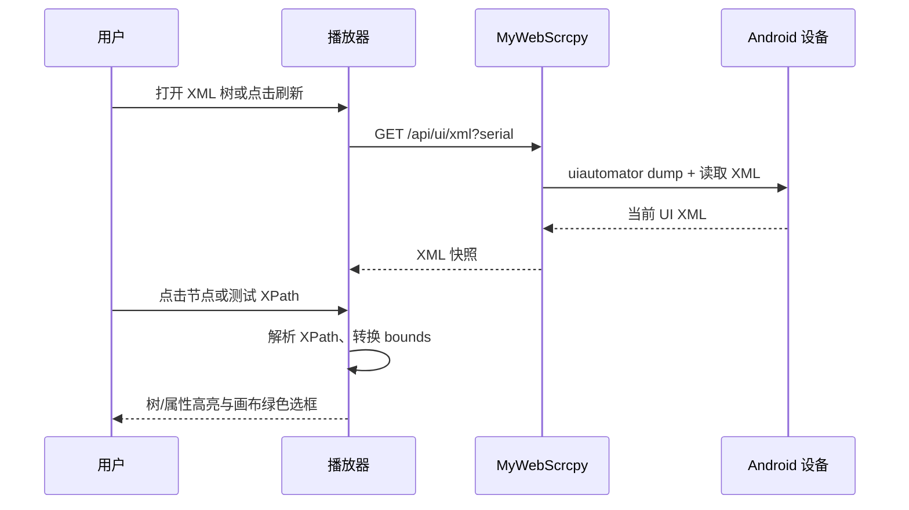

# v1.5.2-feature 设计说明

## 背景

MyWebScrcpy 已能在播放器中显示设备原始分辨率画布，但缺少用于视觉定位、取色和 UI 自动化定位的检查工具。用户需要从当前投屏画面快速取得设备像素坐标和颜色，并用 Android UI XML 树定位元素、验证 XPath 和查看对应画布区域。

10.0.0.11 上的 adb-uiweb 已验证可通过 `uiautomator dump` 取得 XML，并在前端呈现可展开节点树和 `bounds` 选框。MyWebScrcpy 已拥有设备 serial、受控 ADB 执行边界以及与设备分辨率一致的解码 Canvas，因此应在本项目内实现，不引入跨服务代理。

## 目标

1. 在播放器工具栏增加“检查”入口，打开不离开当前页的浮层。
2. 鼠标在投屏画布上移动时，以画布原始像素坐标实时显示 `X × Y`、`#RRGGBB` 和 `rgb(r, g, b)`；同时以放大镜预览指针附近的像素范围并标出中心像素。
3. 获取当前设备的 UI XML，显示可展开树；点击节点显示对应绿色画布框、树行高亮和属性详情；再次点击同一节点取消三者。
4. 在 XML 检查区显示选中元素的属性、稳定 XPath 与该 XPath 的匹配数量；允许输入 XPath 测试，并框出所有命中元素。

## 非目标

1. 不修改设备 UI，不执行 XPath 对应的点击、输入或其他自动化动作。
2. 不连续轮询或每帧执行 `uiautomator dump`；XML 仅按用户打开/刷新请求获取快照。
3. 不承诺所有 Android 应用都能提供可用 UI 节点。Canvas、游戏、WebView 或受保护页面可能只返回空层级或不完整节点。
4. 不复用 Vision 检测的绿色框 Canvas，以免 XML 检查和检测结果互相清除。

## 交互设计

### 检查浮层

播放器工具栏新增“检查”按钮，优先级低于录制、全屏、显示尺寸和区域截图。点击后从右上角展开与录制功能同层级的浮层，内部有“取色坐标”和“XML 树”两个页签；关闭浮层即隐藏检查叠层，但不影响投屏、录制或 Vision。

“取色坐标”页签包含：

- 实时坐标、HEX、RGB 和原始画布尺寸；无指针或画面未就绪时显示可理解的等待状态。
- 13 × 13 源像素放大到 156 × 156 的像素化预览；中心十字线始终指向被取样像素，中心格显示该像素颜色。
- 鼠标进入画布后开始采样；移动事件通过 `requestAnimationFrame` 合并，保证读数跟随指针且不为每个浏览器事件重复绘制。鼠标离开后保留最后一次读数，浮层关闭后停止采样。

滑道或显示尺寸改变不会改变读数语义：坐标始终是设备/Canvas 原始像素，页面 CSS 尺寸只参与一次比例换算。

### XML 树与选择

打开“XML 树”页签时自动取得一份快照，提供“刷新”按钮。树以 `hierarchy` 为根，可按需展开；节点行简洁显示 tag、`class`、`resource-id`、`text` 和 `bounds` 的可用部分。

- 单击树节点：该节点成为唯一树选中项，树行高亮，并在独立 `ui-inspector-overlay` 上画绿色边框。
- 再次单击同一节点：取消树行高亮、详情和绿色框。
- 单击画布绿框：定位并选中对应树节点；再次点击同一框取消。
- 多个 XPath 命中项同时显示绿色框；树的手动单选仍保持独立，避免 XPath 测试破坏用户正在查看的节点。

右侧详情区显示当前手动选中节点的全部 XML 属性、`bounds`、可复制 XPath 与“XPath 命中 N 个”。没有选中节点时保留 XPath 测试区，但属性区显示空状态。

### XPath 测试

输入框占位提示 `例如 //*[@resource-id='app:id/login']`，点击“测试”或按 Enter 后在当前 XML 快照上执行：

1. 显示匹配数量；
2. 将所有匹配且拥有有效 `bounds` 的元素画为绿色框；
3. 无结果显示“未匹配到元素”，非法表达式显示校验错误，不执行 ADB 或修改设备；
4. 清空输入或点击“清除”即移除 XPath 测试框。

生成的元素 XPath 优先使用唯一 `resource-id`；若不唯一，使用基于节点层级和同名兄弟序号的绝对 XPath，确保可复现且计数可验证。

## 数据与接口设计

新增只读接口：

```text
GET /api/ui/xml?serial={serial}
```

服务端固定使用现有 ADB 路径和 serial 校验，依次执行：

```text
adb -s <serial> shell uiautomator dump /sdcard/window_dump.xml
adb -s <serial> exec-out cat /sdcard/window_dump.xml
```

响应为原始 UTF-8 XML，并附带获取时间和设备 serial：

```json
{
  "serial": "10.0.0.30:5555",
  "captured_at": "2026-09-09T12:00:00Z",
  "xml": "<hierarchy>...</hierarchy>"
}
```

服务端限制 XML 响应大小、校验单根 XML，并把设备不可用、dump 失败和无效 XML 分别映射为可识别错误。浏览器用 `DOMParser(..., 'application/xml')` 和 `document.evaluate()` 在这份固定快照中构建树、计算 XPath；树文本必须用 `textContent` 渲染，不能把设备 XML 属性拼入 `innerHTML`。

## 坐标和高亮映射

设画布显示框为 `rect`，内部原始大小为 `(canvas.width, canvas.height)`：

```text
sourceX = floor((pointerX - rect.left) * canvas.width / rect.width)
sourceY = floor((pointerY - rect.top)  * canvas.height / rect.height)
```

坐标钳制到有效像素范围。放大镜从原 Canvas 截取中心周围 13 × 13 像素，以关闭插值的独立 Canvas 绘制。

XML `bounds="[left,top][right,bottom]"` 使用同一原始像素坐标系。独立检查叠层的内部尺寸固定为画布原始尺寸、CSS 尺寸与画布一致，因此可直接按 bounds 绘制而不受“显示尺寸”滑道、全屏或响应式缩放影响。



## 关键决策

1. XML 是按需快照，不尝试和视频帧逐帧同步；浮层显示快照时间，并提供刷新以避免误解为实时 UI 自动化结果。
2. 画布取色完全在浏览器内完成，不增加视频流、截图请求或服务端 CPU 消耗。
3. XML 高亮使用独立叠层；现有 Vision 检测 overlay 保持原有生命周期。
4. XPath 在浏览器中针对当前快照执行，避免对服务器开放任意 XPath 解析接口，也使匹配计数和高亮严格对应同一份 XML。
5. `uiautomator dump` 使用 per-serial 互斥，避免固定设备临时文件被并发 dump 覆盖。

## 风险

| 风险 | 影响 | 缓解 |
| --- | --- | --- |
| UI XML 与视频画面瞬间不一致 | 框位置短暂偏移 | 显示快照时间；提供刷新；不宣称逐帧同步。 |
| 游戏/Canvas 页面没有可用 XML 节点 | XML 树为空或没有 bounds | 保留坐标/取色工具，明确提示当前页面未暴露可检查节点。 |
| 复杂 XPath 或超大 XML 阻塞页面 | 浮层卡顿 | 限制 XML 大小和 XPath 长度；在短任务中执行并捕获异常。 |
| 检测框与检查框互相干扰 | 用户无法判断来源 | 使用独立 overlay 和不同的状态管理。 |

## 迁移计划

1. 新增 UI XML 获取服务、结构化错误和单元测试。
2. 新增播放器检查浮层、坐标取色和放大镜，不改变现有触控事件。
3. 新增 XML 解析、树、属性详情、XPath 计算与独立叠层。
4. 以真实设备验证显示缩放、旋转、全屏、空 XML、XPath 多匹配和取消选择。

## 回滚计划

检查功能是独立入口与只读 API。移除入口和 `/api/ui/xml` 路由即可回退，不影响投屏、控制、录制、区域截图或 Vision。

## 待确认问题

1. XML 树是否只在播放器页提供，当前按需求默认只提供播放器页。
2. XPath 测试命中多个节点时，默认同时显示全部绿色框；若需要逐个导航，可在实施时补充“上一个/下一个”。
3. 手机触控场景没有鼠标悬停，首期坐标取色以桌面鼠标为主；是否需要长按取点需后续确认。
