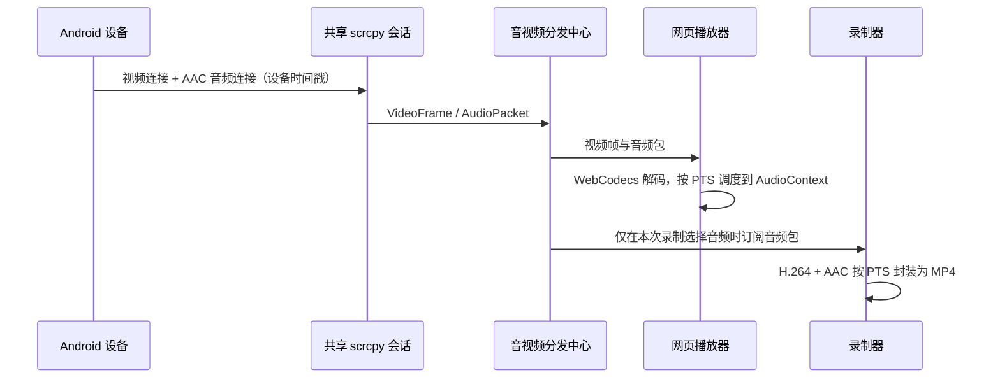

# v1.5.3-feature 设计：设备音频播放与可选录音

## 目标

1. 在播放器工具栏提供音量入口：可静音、恢复声音和调节音量；设备输出音频可同步在网页播放。
2. 在录制弹层提供“同时录制音频”选项，按用户本次选择生成有声或无声 MP4。
3. 音频故障可定位到设备采集、传输、网页解码或录制封装阶段，不能再只呈现笼统的失败提示。

## 范围与边界

- 音源仅为 Android 设备输出音频，不采集浏览器麦克风，也不新增浏览器到设备的音频回传。
- 首期输出容器为 MP4；有声录制采用 H.264 视频轨加 AAC 音频轨。
- 继续保留现有视频控制、共享投屏和视频录制行为。旧客户端未传音频选项时按无声录像处理。
- Android 10 及以下不具备 scrcpy 音频转发条件；这类设备仍可正常投屏和无声录制，并在用户勾选录音时说明音频不可用。
- 不在本版本改变手机扬声器是否同步出声的策略；其效果取决于 Android 版本、设备能力和 scrcpy 音频采集模式，后续如需暴露该策略再单独设计。

## 用户体验

播放器右侧新增扬声器按钮和音量浮层：

- 音频流就绪时，按钮显示当前静音状态；点击可静音或恢复播放。
- 展开浮层后，可用 0–100 的滑道调节网页播放音量；音量为 0 时视为静音。
- 首次进入保持静音，用户主动点按扬声器后开始播放，避免浏览器拦截自动播放。
- 音频尚未就绪、设备不支持或网页解码不可用时，按钮为不可播放状态；浮层给出用户可理解的原因。
- 静音只控制本机网页的音量，不停止设备采集，也不影响已勾选的录制音轨。

录制弹层在时长设置下增加“同时录制音频”复选项，默认不勾选：

- 未勾选：沿用现有无声 MP4 录制。
- 勾选：开始前确认当前会话已有可用的 AAC 音频配置；成功后录像历史标识“含音频”。
- 设备不支持、音频通道未就绪或音频流中断时，含音频录制会明确失败，不生成被误认为有声的无声文件。

## 总体链路



音频和视频共享同一个设备会话。录制是否包含音频只决定录制器是否订阅音频，不影响播放器音量或其他观看者。

## 后端设计

### scrcpy 会话与协议

- `ServerConfig` 增加音频开关和音频编码配置；启用音频的会话以 `audio=true`、`audio_codec=aac` 启动服务端。
- 连接层增加独立音频 socket 的接入、握手和关闭管理。协议实现必须与仓库内实际部署的 scrcpy server 版本严格匹配，不能只按网页端猜测帧格式。
- 新增 `AudioPacket`：`codec`、`ptsUs`、`flags`、`payload`。配置包、普通包、截断包和未知编码分别处理；错误不得被伪装成视频帧。
- 音频包保留设备原始 PTS。网页播放和 MP4 封装都以它作为同步基准，不使用后端接收时间替代。
- 视频连接失败、音频连接失败分别记录原因；视频继续可用时，音频故障只降级播放器音频，不影响无声录像。

### 共享分发

- `managedSession` 新增独立音频订阅和有界缓冲。慢速音频订阅者只能丢弃过期音频，不得堵塞视频、控制指令或其他订阅者。
- 音频配置包由会话缓存；新网页订阅者和新录制器先获得最新配置，再接收后续音频包。
- 重连、会话重置、编码配置变化时广播音频重置事件。网页丢弃旧解码队列后重新建解码器；含音频录制在初始化前失败，初始化后按明确的“音频流中断”原因结束。

### 网页推送与状态

- WebSocket 新增带类型的音频消息和音频状态消息，避免与已有视频二进制消息混淆。
- 状态至少包括：`ready`、`unavailable`、`connecting`、`interrupted`、`decoder_error`，并带可展示的原因码。
- 日志包含设备序列号、会话标识、阶段、音频 codec、首个配置包与首个媒体包时间；不记录音频内容。

### 录制接口与状态

`POST /api/recordings` 请求体扩展为：

```json
{
  "max_duration_ms": 60000,
  "record_audio": false
}
```

- `record_audio` 缺省或为 `false`：兼容现有无声录像。
- `record_audio: true`：录制器等待视频关键帧和 AAC 配置包后再创建双轨 MP4；等待超时、设备不支持或会话未就绪时返回具体失败。
- 响应和录像详情增加 `record_audio`、`audio_status`。历史列表按实际文件轨道显示“含音频”或“无音频”。
- `audio_status` 建议取值：`disabled`、`starting`、`recording`、`unavailable`、`interrupted`、`failed`。这与整体录像状态分开，方便定位部分失败。

### MP4 封装

- 录制封装器从单一 H.264 track 扩展为可选 H.264 + AAC 双轨。
- 只有 `record_audio=true` 时创建 AAC track；视频优先路径仍保持原有输出，避免为无声录像引入行为变化。
- 使用音频配置包初始化 AAC 描述信息，并以 PTS 推导音视频 sample 时序。首个视频关键帧、音频配置包、流重配、长时间无包和结束收尾均需有确定处理。
- 对有声文件以媒体探测验证同时存在 H.264 视频流和 AAC 音频流；不能仅以文件扩展名或字节数判断成功。

## 网页播放同步策略

- 使用 `AudioDecoder` 进行能力探测，只有确认浏览器可解码当前 AAC 配置后才将音频状态设为 `ready`。
- 音频解码后的数据送入 `AudioContext`，以设备 PTS 建立播放时间锚点，并保留小的可调抖动缓冲。
- 检测到积压、页面恢复、连接重置或 PTS 出现大跳变时，清空旧音频队列并重新锚定，优先恢复实时性而非播放过时声音。
- 扬声器按钮首次交互负责恢复 `AudioContext`；之后的静音通过本地 `GainNode` 完成。录制直接使用编码音频包，不依赖浏览器音量和解码状态。

## 错误语义

| 场景 | 网页表现 | 录制行为 | 后端可检索原因 |
| --- | --- | --- | --- |
| Android 不支持音频采集 | 音量入口提示设备音频不可用 | 勾选录音时拒绝开始；无声录像正常 | `audio_unsupported_android` |
| 音频 socket/握手失败 | 视频继续，音频不可用 | 勾选录音时拒绝开始 | `audio_transport_failed` |
| 浏览器不支持解码 | 提示当前浏览器无法播放设备音频 | 含音频录制仍可由服务端执行 | `audio_decoder_unsupported` |
| 录制期间音频中断 | 播放静音并提示中断 | 有声录制以失败原因结束，避免伪成功 | `audio_stream_interrupted` |
| 用户网页静音 | 本地不出声 | 不影响已选择的音频录制 | 无错误 |

## 关键决策与风险

1. **AAC 作为首期传输编码。** 它同时适合网页解码和 MP4 音轨。实际连接仍以服务端返回的 codec/config 为准；若设备不能提供 AAC，本版将清晰报告不可用，不隐式切换为无法在 MP4 可靠封装的编码。
2. **首次网页播放默认静音。** 这是满足常见浏览器自动播放策略的必要交互；用户点按音量按钮后播放。
3. **有声录制不静默回退。** 用户明确勾选后，任何音频不可用都应可见地失败；避免产出名称上看不出问题的无声文件。
4. **音频采用共享会话。** 避免第二个 scrcpy/ADB 会话争抢设备、重复采集和造成音视频源不同步。
5. **设备端扬声器行为不承诺。** Android 版本及设备策略会影响采集后的本机出声；本版只承诺网页播放和可选录制。

## 验收标准

1. 支持设备打开投屏后，用户点按音量按钮可在网页听到设备输出，静音和滑道即时生效。
2. 重新连接、后台恢复或音频流重置后，网页不会持续播放陈旧积压音频，能恢复到接近实时状态或清楚提示不可用。
3. 未选择录音的录像保持当前视频 MP4 行为，且旧接口调用不受影响。
4. 选择录音并满足条件时，导出的 MP4 经媒体探测包含 H.264 与 AAC 两条轨道，音画时间戳连续、可播放。
5. 选择录音而音频不可用时，开始请求返回具体可理解原因；不会静默生成无声录像。
6. Android 10 及以下、Android 11 锁屏启动、网页解码不支持、音频流中断等场景均有可追踪日志和用户提示。
