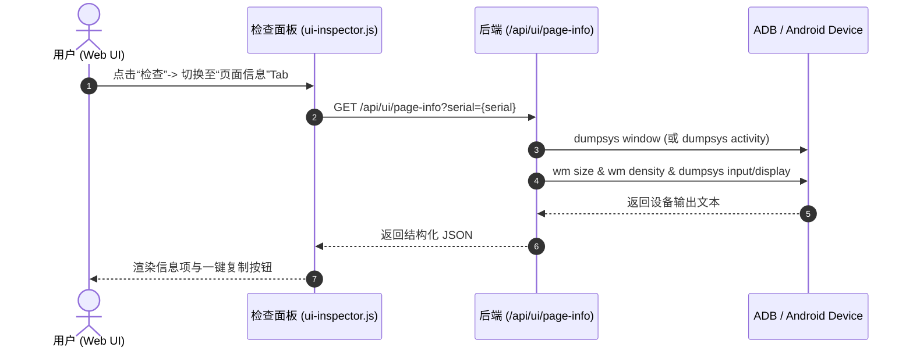

# v1.7.0-feature 设计文档

## 背景

当前 MyWebScrcpy 在播放器界面提供了“检查”面板，内置“取色坐标”与“XML 树”两大功能。开发/测试人员在调试手机应用时，经常需要快速获知当前前台 APP 的应用包名、当前 Activity/UI 页面名、窗口标识，以及屏幕物理分辨率、DPI 和当前旋转角度等基础设备状态。目前只能通过终端执行 `adb shell dumpsys` 查看，不够直观快捷。

## 目标与非目标

**目标：**
- 在播放器“检查”面板中增加第 3 个 Tab：“页面信息 (UI Package)”。
- 后端提供安全、只读的 `/api/ui/page-info?serial=...` 端点，采集并解析前台包名、Activity、焦点窗口、屏幕分辨率、DPI 及方向。
- 前端简洁展示上述字段，支持一键刷新与各字段一键复制，遵循 UI 简洁风格。
- 模块化设计：后端在独立包 `internal/uipage` 中实现解析与 HTTP Handler，编写完整的单测与兼容性测试。

**非目标：**
- 不修改设备端系统状态（纯只读查看）。
- 不引入重型外部依赖或常驻守护进程。

## 交互时序

## 关键决策

### 1. 独立模块 `internal/uipage`
不堆砌在 `internal/uixml` 中，将页面和应用信息提取放在独立包 `internal/uipage`，降低耦合度，保持单个文件控制在合理行数。

### 2. 多 Android 版本容错解析
前台焦点优先解析 `dumpsys window` 中的 `mCurrentFocus` 与 `mFocusedApp`；若由于弹窗/键盘导致未获取到主 Activity，备选解析 `dumpsys activity activities`；屏幕尺寸结合 `wm size` 与 `wm density`，旋转方向从 `dumpsys input` (SurfaceOrientation) 或 display 获取。

## 风险与权衡

- [命令执行耗时]：`dumpsys` 系列命令在低端设备上耗时约 100-300ms，后端使用 context 超时控制与 per-serial 锁控制并发，防止重复连击造成设备阻塞。
