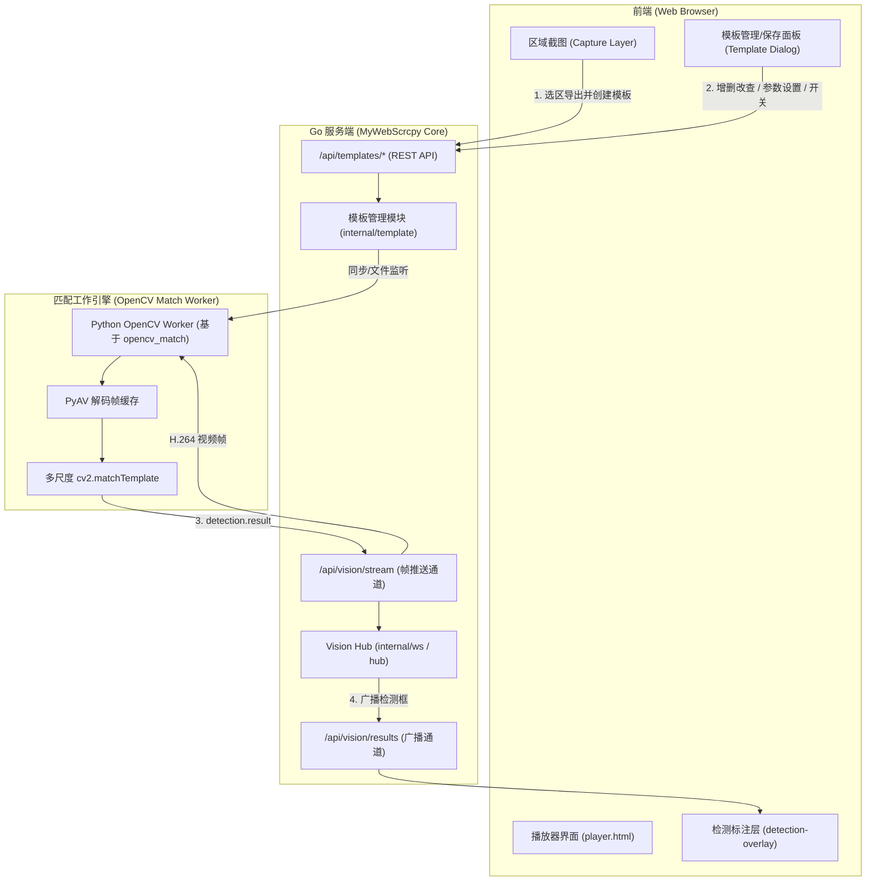
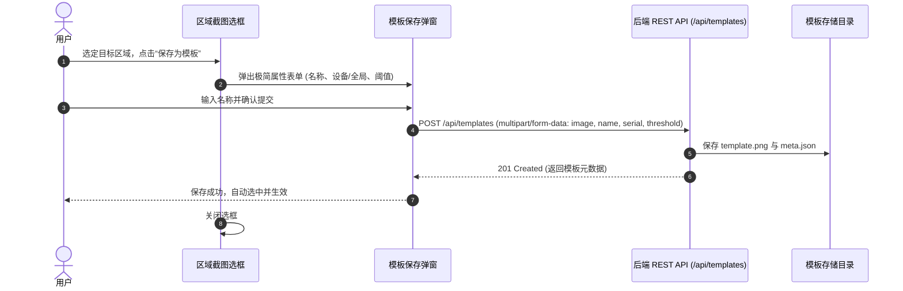
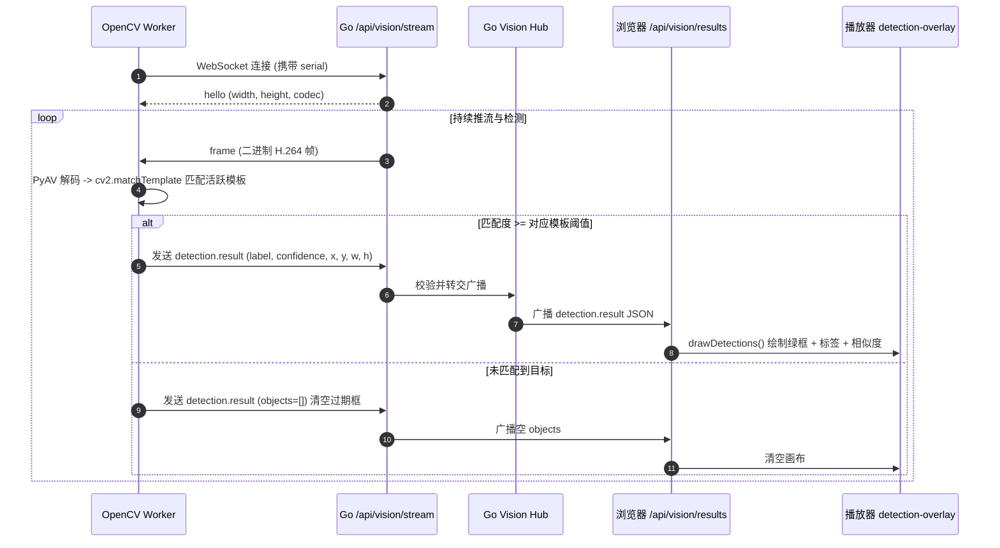
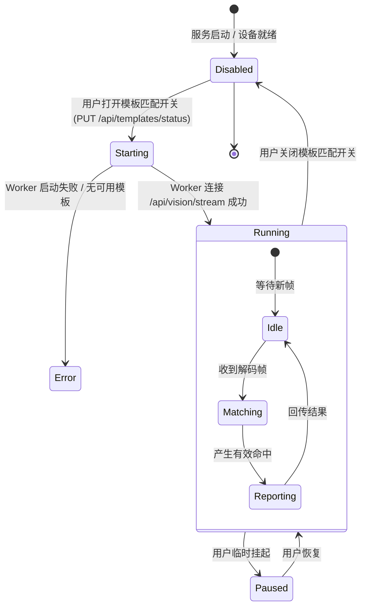

# v1.8.0-feature 设计文档：OpenCV 模板匹配管理与通用接入

## 1. 背景与现状

MyWebScrcpy 目前已具备强大的底层视频旁路能力与前端标注体系：
1. **现有 Vision 通道**：通过 `/api/vision/stream` 提供二进制 H.264 视频帧旁路推送，并接收上行 `detection.result`；通过 `/api/vision/results` 广播给浏览器。
2. **现有前端标注体系**：`player.html` 的 `detection-overlay` Canvas 已有完整的绿框、标签及置信度渲染逻辑，并支持 `btn-toggle-green-boxes` 显隐控制。
3. **现有区域截图体系**：播放器具备精细的 Canvas 区域截图选框（放大镜、BBOX、下载/复制功能）。

**当前痛点**：
- 缺少系统化的**模板管理能力**（模板增删改查、阈值调节、设备绑定必须手动写代码或在外部处理）。
- 外部 OpenCV 匹配（如 `yolo_wepork/opencv_match`）与主服务处于割裂状态，无法在 Web 界面上一键从选区保存模板，也无法在界面上直接启停和查看匹配状态。

---

## 2. 目标与非目标

### 目标
1. **保留旧接口兼容性**：保留原有的 `/api/vision/stream` 与 `/api/vision/results` WebSocket 接口规范，既有自动化脚本与外部 AI（如 YOLO/OCR）无缝工作。
2. **模板管理接口与存储**：
   - 建立设备隔离与全局共享两级模板管理（增删改查、重命名、参数调节：`threshold`、`method`、`grayscale`、`scales`、`enabled`）。
   - 持久化至本地目录 `data/templates/{device_or_global}/{template_id}/`。
3. **区域截图直存模板**：
   - 在播放器区域截图栏新增“保存为模板”按钮，弹出极简配置抽屉，一键将当前选区像素切片并注册为模板。
4. **状态查询与实时回传**：
   - 提供匹配结果实时 WebSocket 推送与 HTTP 查询端点（返回名称、置信度、归一化坐标、像素尺寸）。
5. **匹配引擎启停控制**：
   - 支持针对特定设备或全局随时开启/关闭模板匹配。
6. **投屏绿框复用**：
   - 匹配结果标准化输出为 `detection.result`，对接现有 `detection-overlay` 自动显示绿框。

### 非目标
- 不重写前端 Canvas 绿框渲染器（直接复用）。
- 不在 Go 进程内强行引入 CGO/libopencv 编译依赖（采用零 CGO 模式 + 外部优化 Worker，保证 Go 跨平台单二进制特性）。

---

## 3. 架构与时序设计

### 3.1 总体架构分层

### 3.2 区域截图直存模板时序

### 3.3 模板匹配与绿框回传时序

### 3.4 匹配功能状态机

---

## 4. API 契约与接口规范

所有接口均保留旧有逻辑兼容。旧版 `/api/vision/*` WebSocket 不做任何破坏性变动。

### 4.1 模板管理接口

| 方法 | 路径 | 说明 |
| --- | --- | --- |
| GET | `/api/templates` | 获取模板列表（支持 `?serial=xxx` 筛选，默认包含对应设备及 global 模板） |
| POST | `/api/templates` | 创建模板（支持上传图片文件或 Base64，设定名称、设备、阈值、尺度等） |
| GET | `/api/templates/{id}` | 获取单个模板详细参数与配置 |
| PUT | `/api/templates/{id}` | 更新模板参数（名称、阈值、缩放、排他组、启用状态等） |
| DELETE | `/api/templates/{id}` | 删除模板及对应图片文件 |
| GET | `/api/templates/{id}/image` | 获取模板原始图片（PNG） |

### 4.2 匹配控制与状态接口

| 方法 | 路径 | 说明 |
| --- | --- | --- |
| GET | `/api/templates/status` | 查询指定设备的匹配服务运行状态及活跃配置（`?serial=...`） |
| PUT | `/api/templates/status` | 开启或关闭指定设备的模板匹配（`{"serial":"...","enabled":true}`） |
| GET | `/api/templates/matches` | 查询指定设备最新一帧的模板匹配命中列表（名称、坐标、匹配度、时间戳） |

---

## 5. 关键决策与权衡

### 1. 为什么不采用纯 Go 实现模板匹配？
- **性能与算力开销**：Go 标准库图像处理偏向通用静态图，缺少 OpenCV 针对 AVX2/AVX-512/NEON 的矩阵 SIMD 极致加速；纯 Go 循环做多尺度滑窗匹配会导致 CPU 100% 飙高并掉帧。
- **开源生态复用**：已有的 `yolo_wepork/opencv_match` 已经过实战验证（支持多尺度、色彩过滤、子区域比对），直接采用成熟的 Python OpenCV 算法 Worker 作为引擎最稳妥高效。

### 2. 为什么保持 `/api/vision/stream` 通道不变？
- **高度解耦**：Go 后端保持为高性能的 I/O 网关和连接中心，算法作为客户端通过标准协议旁路接入，完全不影响核心 scrcpy 投屏转发。
- **无缝融合绿框**：前端既有的 `drawDetections` 函数基于该通道的广播机制工作，新增模板匹配功能无需在前端写第二套 WebSocket 连接与 Canvas 绘制器。

---

## 6. 风险与应对方案

1. **多模板匹配性能抖动**：
   - 应对：模板支持 `enabled` 单独启停；支持设定 `max_fps`（如 5~10 帧采样）；多尺度参数默认设为 `[1.0]`，由用户在高级设置中按需添加缩放。
2. **选区误存空图或极小图片**：
   - 应对：前端与后端双重限制最小尺寸（如 >= 10x10 像素），超出边界或无效裁剪时拦截提示。
3. **设备旋转与分辨率切换**：
   - 应对：视频流协议本身具备 `kind=3` 尺寸变化重协商通知，Worker 接收到后自适应更新归一化映射。
