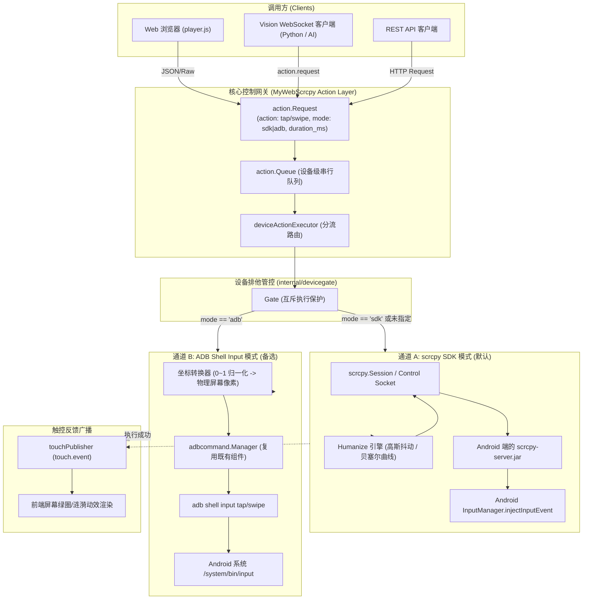
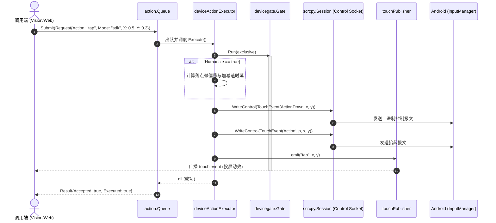
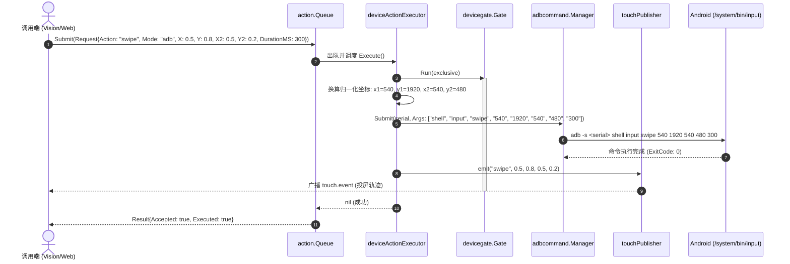
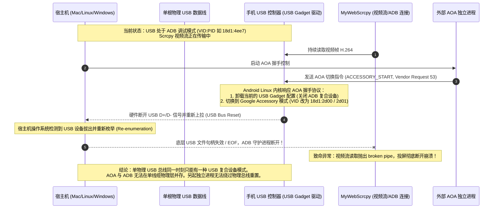

# v1.9.0-feature 设计文档：设备控制通道扩展（SDK 与 ADB 双模式架构）

## 1. 背景与现状

MyWebScrcpy 目前拥有成熟的投屏与动作执行体系：
1. **控制通道现状**：所有来自 Web 端（鼠标/键盘事件）或外部 Vision 客户端（`action.request`）的控制动作，均统一汇聚至设备级动作队列 `action.Queue`，并由 `deviceActionExecutor` 负责执行。
2. **底层执行方式**：当前仅支持 scrcpy 控制 Socket 协议（即 `sdk` 模式）。底层通过在 Android 端运行的 `scrcpy-server.jar` 内部反射调用系统 `android.hardware.input.InputManager` 的 `injectInputEvent` 注入 `MotionEvent` / `KeyEvent`。
3. **优势与痛点**：
   - **优势**：延迟极低（局域网/USB 连接下 1~3ms）、支持高帧率多点平滑轨迹注入、支持自定义贝塞尔拟人化滑动（`humanize=true`）。
   - **痛点**：在部分特殊机型、定制 ROM、游戏防作弊环境或特定系统安全键盘弹出时，系统会针对应用层虚拟注入进行拦截（如安全窗口只接收物理触控或系统 shell 注入）；
   - **补充手段需求**：用户与自动化测试脚本急需一种“穿透性更强、不依赖 scrcpy 服务进程内部状态”的替代手段。最天然的替代手段是 Android 官方自带的命令行工具 `adb shell input tap/swipe`。
   - **多模式探索**：在技术选型过程中，探索了包括 AOA (OTG USB HID)、UHID、sendevent、ADB input 等多种机制，需要形成清晰的技术结论与架构分流实现。

---

## 2. 目标与非目标

### 目标
1. **控制通道双模式扩展**：
   - 动作请求（`action.Request` 与 Vision WebSocket / HTTP 上行协议）扩展 `mode` 字段，支持 `"sdk"`（默认）与 `"adb"`。
   - 增加 `duration_ms` 字段，用于支持滑动（swipe）指定耗时，以及未来的长按等时长需求。
2. **100% 向后兼容**：
   - 当调用方未提供 `mode` 时，系统缺省自动沿用既有的 `"sdk"` 模式与既有流程。
   - 既有的 `humanize`（拟人化落点偏移与贝塞尔微抖动）在 `sdk` 模式下保持原有行为不变。
3. **统一归一化坐标换算**：
   - 无论选择 `sdk` 还是 `adb` 模式，上层接口统一使用 `0.0 ~ 1.0` 归一化浮点坐标，避免调用者关心具体设备屏幕分辨率。
   - 在 `adb` 模式执行前，服务端自动结合当前设备的实际屏幕物理尺寸（`meta.Width` 与 `meta.Height`）进行精准像素映射与边界安全约束（Clamping）。
4. **复用与串行化保护**：
   - `adb` 模式底层直接复用既有的 `internal/adbcommand/manager.go` 执行，避免单次控制反复 fork 未受控的独立子进程。
   - 动作严格在设备级队列与 `devicegate.Gate` 保护下串行执行，杜绝并发竞争。
   - ADB 模式执行成功后，联动触发 `touch.event` 广播，投屏界面依然能渲染对应的触控圆环动效。

### 非目标
1. **不引入 AOA / OTG USB 模式**：不通过 USB 协议直接模拟物理 HID 键盘鼠标（详见下文单 USB 物理线缆冲突分析）。
2. **不引入 UHID 虚拟设备**：不直接在 scrcpy 服务中挂载 Linux 内核 `/dev/uhid`。
3. **不引入 sendevent 机制**：不采用需 Root 权限的底层 Linux Event 注入。
4. **不重构既有的动作队列核心架构**：`action.Queue` 的先进先出、超时丢弃与单协程执行语义保持完全稳定。

---

## 3. 技术选型与可行性评估矩阵

针对 Android 设备的自动化控制，行业内常见的五种技术实现方式对比如下：

| 评估维度 | 1. scrcpy SDK 注入 (`sdk`) | 2. ADB Shell Input (`adb`) | 3. 内核 UHID (`uhid`) | 4. AOA / OTG 物理 HID (`aoa`) | 5. Linux 事件写入 (`sendevent`) |
| :--- | :--- | :--- | :--- | :--- | :--- |
| **底层实现机制** | scrcpy-server 通过 Java 反射调用 `InputManager.injectInputEvent` | 宿主机执行 `adb shell input tap/swipe` (UID 2000) | scrcpy 打开 `/dev/uhid` 注册虚拟 HID 设备注入报告 | PC 通过 USB AOA 2.0 协议让手机变从设备，模拟物理 USB 键鼠 | 宿主机/Shell 直接向 `/dev/input/eventX` 写入原始二进制结构 |
| **延迟表现** | **极低 (1~3 ms)** | 中等 (50~150 ms，包含 shell 进程启动开销) | 低 (3~8 ms) | 极低 (1~2 ms，硬件中断级别) | 低 (10~20 ms) |
| **权限要求** | ADB 权限（启用“USB调试(安全设置)”） | 基础 ADB 权限 (`android.permission.INJECT_EVENTS`) | 依赖系统是否放通 `/dev/uhid`（Android 9+ 支持，但部分厂商受限） | 无需开启 USB 调试，但需硬件物理握手 | **必须 Root 权限**（普通 Shell 无读写 eventX 权限） |
| **单 USB 线并存可行性** | **完全支持** (复用现有 Socket) | **完全支持** (复用现有 ADB 通道) | **完全支持** (复用现有 scrcpy 进程) | **完全不可行** (单 USB 线会触发总线重枚举导致投屏中断) | **完全支持** (基于 ADB Shell) |
| **拟人化手势支持** | **原生支持** (贝塞尔曲线、变速、高斯抖动) | **仅支持直线** (持续时间通过 duration 参数控制) | 支持相对移动，触摸绝对坐标需复杂 Digitizer 报文 | 支持绝对点需 Digitizer 报告符，复杂且难适配 | 需自行解析并注入密集 SYN 帧，极其繁琐 |
| **坐标适应性** | 自动映射到当前视频流/窗口分辨率 | 需转换为设备真实物理像素（`wm size`） | 鼠标仅支持相对偏移；触摸屏需校准量程 | 依赖报告描述符最大量程映射 | **高度碎片化**（不同屏幕量程 0~32767 或 0~4095 差异巨大） |
| **防作弊与安全窗口** | 遇到部分银行/游戏页面会被虚拟注入检测拦截 | **穿透力极强**（系统官方命令行工具，兼容性好） | 被识别为外接物理外设，部分安全窗口允许 | 被系统识别为物理硬件外接外设，穿透性最强 | 绕过应用层，但因 Root 易被风控检测 |
| **选型结论** | **保留并作为默认模式** | **正式集成，作为辅助/高穿透模式** | **剔除** (相对坐标无法满足精确点击与滑动) | **剔除** (单 USB 线造成物理重枚举，视频必断流) | **剔除** (必须 Root 且硬件量程难以通用) |

---

## 4. 详细架构与时序图

### 4.1 双通道分流架构



---

### 4.2 控制时序图

#### 4.2.1 SDK 模式（默认低延迟通道）



#### 4.2.2 ADB 模式（系统工具穿透通道）



---

### 4.3 剔除方案深度分析：单 USB 线下 AOA 导致断流原理

在需求分析阶段，曾探讨过“能否另起独立后台进程运行 AOA / OTG 模拟硬件触控”，结论为：**在单根物理 USB 连接下，在原理层面完全不可行**。



---

## 5. 接口与数据结构设计

### 5.1 内部数据结构扩展 (`internal/action/action.go`)

在 `action.Request` 中新增 `Mode` 与 `DurationMS` 字段：

```go
type Request struct {
	RequestID  string  `json:"request_id"`
	DeviceID   string  `json:"device_id"`
	Source     string  `json:"source"`
	Action     string  `json:"action"`                // "tap", "swipe", "key", "text", "raw"
	Mode       string  `json:"mode,omitempty"`        // 执行模式: "sdk" (默认) 或 "adb"
	DurationMS int64   `json:"duration_ms,omitempty"` // 动作耗时(毫秒): 对 swipe/tap 有效
	X          float64 `json:"x,omitempty"`
	Y          float64 `json:"y,omitempty"`
	X2         float64 `json:"x2,omitempty"`
	Y2         float64 `json:"y2,omitempty"`
	Text       string  `json:"text,omitempty"`
	Keycode    uint32  `json:"keycode,omitempty"`
	MetaState  uint32  `json:"meta_state,omitempty"`
	Raw        []byte  `json:"-"`
	FrameID    uint64  `json:"frame_id,omitempty"`
	ExpiresMS  int64   `json:"expires_ms,omitempty"`
	Humanize   bool    `json:"humanize,omitempty"`
}
```

### 5.2 协议层扩展 (`internal/vision/protocol.go`)

在 Vision 模块双向 WebSocket 的 `vision.Message` 结构中同步扩展：

```go
type Message struct {
	// ... 既有字段 ...
	Mode       string  `json:"mode,omitempty"`        // "sdk" 或 "adb"
	DurationMS int64   `json:"duration_ms,omitempty"` // 毫秒
	// ...
}
```

### 5.3 WebSocket 消息交互范例

#### 5.3.1 ADB 模式下的单击 (Tap)
```json
{
  "type": "action.request",
  "request_id": "req-adb-tap-001",
  "action": "tap",
  "mode": "adb",
  "x": 0.5,
  "y": 0.5,
  "expires_ms": 3000
}
```
**响应 (`action.result`)**：
```json
{
  "type": "action.result",
  "request_id": "req-adb-tap-001",
  "device_id": "device_serial_123",
  "session_id": "sess_456",
  "accepted": true,
  "executed": true
}
```

#### 5.3.2 ADB 模式下的带耗时滑动 (Swipe)
```json
{
  "type": "action.request",
  "request_id": "req-adb-swipe-002",
  "action": "swipe",
  "mode": "adb",
  "x": 0.5,
  "y": 0.8,
  "x2": 0.5,
  "y2": 0.2,
  "duration_ms": 500,
  "expires_ms": 5000
}
```

---

## 6. 坐标系统换算机制

上层统一采用归一化坐标系统，定义如下：
- $X \in [0.0, 1.0]$：从屏幕左边缘（0.0）到右边缘（1.0）。
- $Y \in [0.0, 1.0]$：从屏幕上边缘（0.0）到下边缘（1.0）。

### 6.1 像素换算公式
在 `deviceActionExecutor` 中，当前连接会话维护了设备的物理宽度 $W$ 与物理高度 $H$（来自当前投屏元数据 `meta.Width` 与 `meta.Height`，或者通过 `wm size` 获取的标准物理屏宽高）：

$$X_{px} = \operatorname{clamp}\left(\operatorname{round}(X \times W), 0, W - 1\right)$$
$$Y_{px} = \operatorname{clamp}\left(\operatorname{round}(Y \times H), 0, H - 1\right)$$

### 6.2 ADB 命令行参数组装规范
1. **Tap 动作**：
   - 目标命令：`adb -s <serial> shell input tap <X_px> <Y_px>`
   - 示例：`["shell", "input", "tap", "540", "1170"]`
2. **Swipe 动作**：
   - 若 `duration_ms > 0`：`adb -s <serial> shell input swipe <X1_px> <Y1_px> <X2_px> <Y2_px> <duration_ms>`
   - 若 `duration_ms <= 0`：缺省不传时长参数或默认由系统分配（通常为 300ms）。
   - 示例：`["shell", "input", "swipe", "540", "1800", "540", "400", "450"]`

---

## 7. 剔除项技术备忘与边界说明

### 7.1 为什么不采用 AOA / OTG 模式？
1. **单物理线缆冲突**：如 4.3 节所述，绝大多数用户与自动化测试台架仅有一根 USB 线连接 Android 手机。启动 AOA 模式会强制要求将手机的 USB 从机模式切换为 Accessory 模式，必然重置 USB 总线。这一重置会直接掐断已建立的 ADB 连接和 Scrcpy 视频推流，形成“开 AOA 则投屏必死”的致命互斥。
2. **多进程并发无法隔离**：即使在宿主机使用独立的 Python 或 Go 进程管理 AOA，也无法突破物理 USB 端口仅能工作在单一 USB 模式的物理层事实。
3. **适用场景极其受限**：AOA 模式仅在手机双物理端口，或投屏完全走 Wi-Fi 网络 ADB、仅留一根物理 USB 线专门连接硬件从机的双通道物理拓扑下可用，不具备通用性。

### 7.2 为什么不采用 UHID 模式？
1. **相对坐标限制**：scrcpy 官方实现的 UHID 鼠标模式向内核注入的是标准相对位移 HID 鼠标报文（`dx`, `dy`），不支持绝对点位点击与瞬时跳转；
2. **绝对触控描述符碎片化**：若模拟绝对坐标多点触摸屏（Digitizer），HID 报告描述符构造极其繁琐，且不同 Android 厂商内核对多点触控 HID 报文的解析逻辑各异，极易在部分机型上失灵；
3. **权限与环境约束**：部分第三方 ROM 即使在 Android 9+ 也限制普通 Shell 对 `/dev/uhid` 节点的写权限。

### 7.3 为什么不采用 sendevent 模式？
1. **严格 Root 依赖**：Android 对 `/dev/input/event*` 的权限管控极其严格（权限为 `crw-rw---- root input`），普通 ADB Shell（UID 2000）无权限写入，商用与日常真机绝大多数未 Root；
2. **硬件参数量程碎片化**：不同手机屏幕的触摸 IC 坐标量程完全不同（例如索尼/小米可能是 0~32767，华为可能是 0~4095，有的甚至是物理毫米），必须先通过 `getevent -p` 解析每个设备的 `ABS_MT_POSITION_X/Y` 极值才能换算，且需要精准发送 `EV_ABS`、`EV_SYN` 报文序列，极易造成硬件漏点与按键黏滞。
